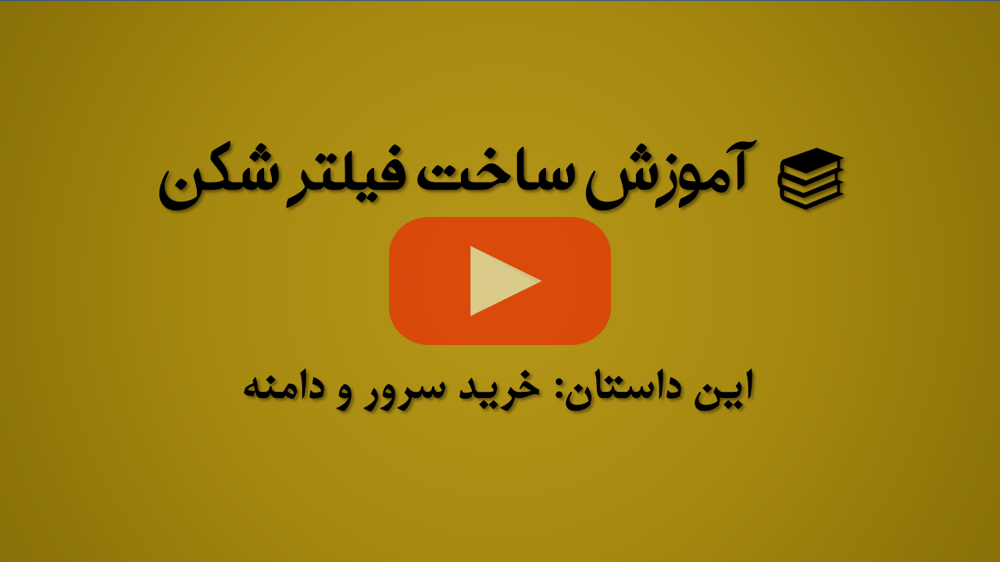

<div dir=auto>

# آزادی

<p align="center">
    <a href="https://youtu.be/cczU4R19Jxc">
        
        </img>
    </a>
</p>

با توجه به شرایط فیلترینگ موجود در کشور، همچنین نیاز افراد و کسب و کارها به اینترنت آزاد، این آموزش ساخته شده است تا کمکی باشد به رفع مشکلات دسترسی به اینترنت آزاد.

هدف ما بیان آموزش به ساده ترین شکل ممکن هست همراه با بهینه سازی ها و نکات فنی به گونه ای که هر شخصی با حداقل دانش لینوکسی بتواند برای خود فیلترشکن شخصی راه اندازی کند.

مراحل کار به اینصورت میباشد:

## خرید سرور و دامنه

<p align="center">
    <a href="https://www.youtube.com/channel/UCXbI_icUiT-W4BmjPWQtHFQ">
        
        </img>
    </a>
</p>

- خرید سرور با سیستم عامل `ubuntu` و ورژن `20.04` و یا `22.04` . توصیه میکنیم حدالمقدور از سایت های ایرانی خرید نکنید.
- خرید دامنه. میتوانید از سایت هایی مانند [namecheap](https://namecheap.com)  با پرداخت رمز ارز دامنه مورد نیاز خود را تهیه کنید.

## آماده سازی سرور و دامنه

- [آماده سازی سرور](server-setup/README.md)
- [آماده سازی دامنه](cloudflare/README.md)

## نصب سرویس های مورد نظر

ابتدا با دستور زیر فایل های مورد نیاز را دریافت کنید.

```bash
wget https://github.com/rahgozar94725/freedom/releases/download/14011122/freedom.tar.gz && tar -xzvf freedom.tar.gz -C /opt/
```

- [نصب nginx](nginx/README.md)
- [نصب پنل x-ui](x-ui/README.md)
- [نصب shadowsoks](Shadowsocks/README.md)
- [نصب shadowsocksr](Shadowsocksr/README.rtl.md)

## ارتباط با ما

- [کانال تلگرام](https://t.me/rahgozar94725_channel)
- [گروه تلگرام](https://t.me/rahgozar94725_group)

---

##### دونیت

اگر این آموزش به شما کمک کرده است و در صورت تمایل میتوانید با دونیت کردن، از من حمایت کنید.

```text
Bitcoin (BTC)
bc1qg6n8kpa7nfscft8ltfxpckeuj9lytmnma80w5k

Tether (USDT - ERC20)
0x51bc905cF39641D46c7E4190cE279830711FB86e

Tether (USDT - TRC20)
TCG4f449FvLFgkjtkdWvrwC6N9cUXmE9GQ

Litecoin (LTC)
ltc1qapac5j405lavr30yt24ycpsf6g40pl6xmd9f5q

Dogecoin (DOGE)
DCKeC5xBr6RbAWzTz6nPJM6pU12gyP9GX4
```


