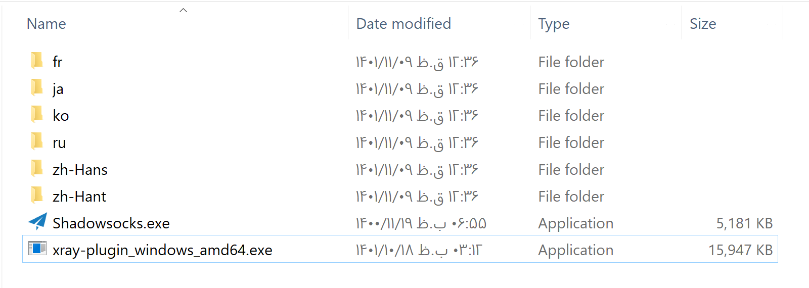
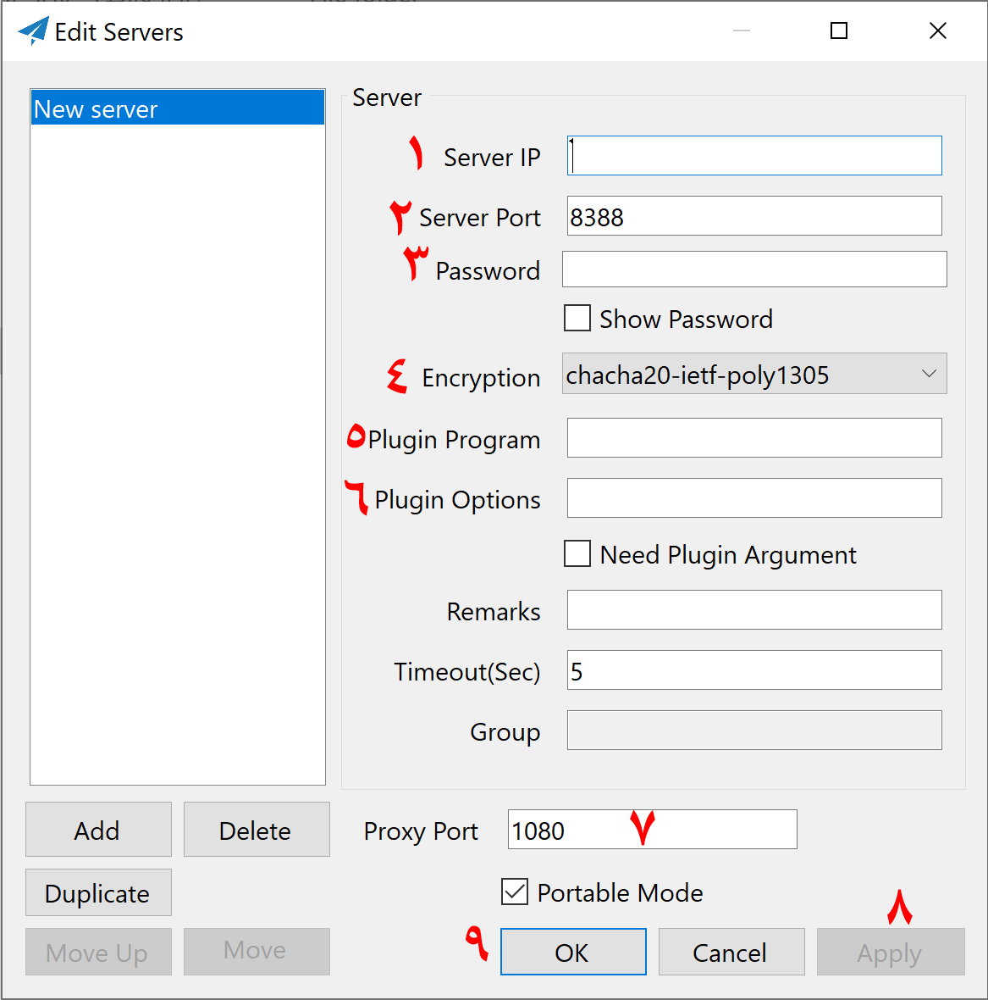

<div dir=auto  align="right">

# نصب shadowsocks

برای نصب ابتدا وارد پوشه `shadowsocks` شوید

```bash
cd /opt/freedom/shadowsocks
```

## تنظیمات مربوط به فایل کانفیگ

با دستور زیر یک کپی از فایل `config-sample.json` ایجاد میکنیم

```bash
cp config-sample.json config.json
```

با دستور زیر فایل `config.json` را باز کنید و پس از انجام تغییرات لازم با زدن کلیدهای `ctrl + x` و `y` و `enter` تغییرات را ذخیره کنید.

```bash
nano config.json
```

محتوای فایل مذکور به شکل زیر است:

```json
{
  "server": "0.0.0.0",
  "server_port": 7070,
  "password": "password",
  "timeout": 300,
  "method": "aes-128-gcm",
  "nameserver": "8.8.8.8",
  "mode": "tcp_and_udp",
  "plugin": "xray-plugin",
  "plugin_opts": "server;mode=grpc;serviceName=grpc7070"
}
```

### تغییر `port`

مقدار `server_port` را به مقدار دلخواه خود تغییر دهید. توصیه می‌شودعددی چهار رقمی انتخاب کنید.

### تغییر `password`

مقدار `password` را به پسورد دلخواه تغییر دهید. توصیه می‌شود از پسورد پیشفرض استفاده نکنید

### تغییر `method`

برای `method` می‌توانید یکی از مقادیر زیر را انتخاب کنید:

```txt
plain
none
aes-128-gcm
aes-256-gcm
chacha20-ietf-poly1305
```

متود پیشنهادی ما `chacha20-ietf-poly1305` هست.

### تغییر plugin

#### بدون plugin

اگر بخواهید فقط شدوساکس داشته باشید، باید دوقسمت `plugin` و `plugin_opts` را خالی بگذارید. در اینصورت میتوانید از کلاینت های شدوساکس و همچنین `outline` متصل شوید. اما توصیه ما به دلیل اینکه شدوساکس به تنهایی توسط فیلترینگ قابل شناسایی هست، این است که از پلاگین استفاده کنید.

#### همراه با plugin

##### انتخاب plugin

برای `plugin` میتوانید یکی از مقادیر زیر را انتخاب کنید.

```text
v2ray-plugin
xray-plugin
```

پلاگین پیشنهادی ما `xray-plugin` هست

##### انتخاب plugin_opts

ما در این قسمت نیز قصد داریم از `nginx` برای مدیریت `TLS` و تک پورت بودن استفاده کنیم، بنابراین برای `plugin_opts` یکی از مقادیر زیر را انتخاب کنید.

```text
server;mode=grpc;serviceName=grpc7070
server;path=/wss7070
```

- هرکدام از موارد فوق را انتخاب کردید، اگر در مرحله تغییر پورت 7070 را تغییر داده اید، در عبارات فوق نیز پورتی را که انتخاب کردید با 7070 جایگزین کنید.
- توصیه ما تست هر دو مورد هست. هنگام تست هر دو مورد به خوبی کار میکنند.

## راه‌اندازی

با دستور زیر کانتینر را اجرا کنید:

```bash
docker-compose up -d
```

با دستور زیر می‌توانید لاگ سرور را ببینید:

```bash
docker-compose logs -f
```

با دستور زیر می توانید سرور را خاموش کنید:

```bash
docker-compose down
```

با دستور زیر می توانید کانتینر خود را به جدیدترین ورژن منتشر شده آپدیت کنید.

```bash
docker-compose down && docker-compose up --pull always -d
```

# کلاینت

## ویندوز

### کلاینت اصلی

ابتدا از لینک زیر آخرین ورژن کلاینت را دانلود کنید.

> [shadowsocks-windows](https://github.com/shadowsocks/shadowsocks-windows/releases)

از لینک زیر آخرین نسخه پلاگین `xray` را دانلود کنید

> [xray-plugin](https://github.com/teddysun/xray-plugin/releases)

مانند تصویر زیر پلاگین دانلود شده را به پوشه کلاینت شدوساکس انتقال دهید.

<p align="center">
    
    </img>
</p>

نرم افزار را اجرا کنید. آیکون آن در کنار ساعت ویندوز نمایان میشود. با دبل کلیک روی آن پنجره زیر باز میشود.

<p align="center">
    
    </img>
</p>

طبق توضیحات اطلاعات لازم را تکمیل کنید.

- در شماره یک اگر طبق آموزش پیشرفته باشید چند انتخاب دارید

  - از دامنه مستقیم `sub.test.com` استفاده کنید
  - از دامنه `CDN` کلاودفلر `subcdn.test.com` استفاده کنید
  - از دامنه `CDN` آروان `subcdn.test1.com` استفاده کنید
  - از کاستوم آیپی کلاودفلر استفاده کنید
  - از دامنه هایی که از `CDN` کلاودفلر استفاده میکنند و فیلتر نیستند مثل `discord.com` استفاده کنید

- در شماره 2 اگر طبق آموزش پیشرفته باشید `443` و یا `2083` را میتوانید وارد کنید
- در شماره 3 پسوردی را که در مراحل نصب انتخاب کردید وارد کنید
- در شماره 4 از لیست باز شونده متودی را که در مرحله نصب انتخاب کرده بودید وارد کنید
- در شماره 5 نام فایل پلاگینی را که دانلود کردید بنویسید در مثال ما `xray-plugin_windows_amd64` هست.
- در شماره 6 با توجه به انتخابی که در مرحله نصب انجام داده اید یکی از حالت های زیر را انتخاب کنید. اگر در مرحله نصب پورت `7070` را تغییر داده اید آن را جایگزین کنید. دقت کنید در قسمت `host` از هر `CDN` که استفاده میکنید باید دامنه مستقیم آن `CDN` را وارد کنید.

  - اگر انتخابتان `server;mode=grpc;serviceName=grpc7070` بود، `tls;host=sub.test.com;serviceName=grpc7070` را وارد کنید.
  - اگر انتخابتان `server;path=/wss7070` بود، `tls;host=sub.test.com;path=/wss7070?ed=2048` را وارد کنید.

- در شماره 7 پورت پروکسی ایجاد شده در ویندوز را میتوانید تغییر دهید. به صورت پیشفرض روی پورت `1080` یک پروکسی `socks5` ایجاد میشود که با اتصال به آن میتوانید به فیلترشکن متصل شوید.
- در شماره 8 روی `Apply` کلیک کنید
- در شماره 9 روی `Ok` کلیک کنید.

</div>
