## چرا CloudFlare ؟

بعد از خرید دامنه و سرور برای مدیریت رکوردهای DNS دامنه میتوان از پنل سایتی که دامنه از آن خریداری شده، استفاده کرد. اما `CloudFlare` علاوه بر امکانات مدیریت DNS یکی از بهترین خدمات CDN در حال حاظر را ارائه می‌کند که استفاده از آن برای ما مزایایی دارد از جمله به این وسیله ip سرور ما مخفی می‌ماند که کمک می‌کند تا ip فیلتر نشود یا اگر ip فیلتر شده باشد باز با کمک این روش میتوان از سرور بدون مشکل استفاده کرد. همچنین درصورتی که سرور ما از لوکیشن‌های مناطق دورتری نسبت به ایران باشد با این روش لاتنسی ما بهبود چشمگیری می‌کند.

## ثبت دامنه در CloudFlare

بعد از ثبت نام در سایت وارد صفحه اصلی داشبورد خود میشویم. در اینجا بر روی `Add a Site` می‌زنیم.

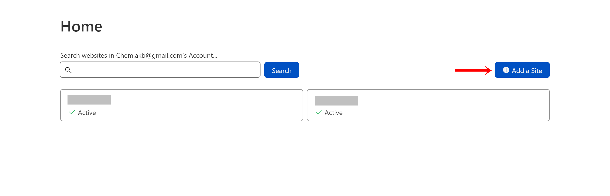

در این مرحله نام دامنه خود را وارد کرده و روی `Add Site` کلیک کنید. من در اینجا برای آموزش از دامنه فرضی `test.com` استفاده میکنم.

در پنجره بعدی ابتدا روی `Free` و سپس روی `Continue` کلیک کنید.

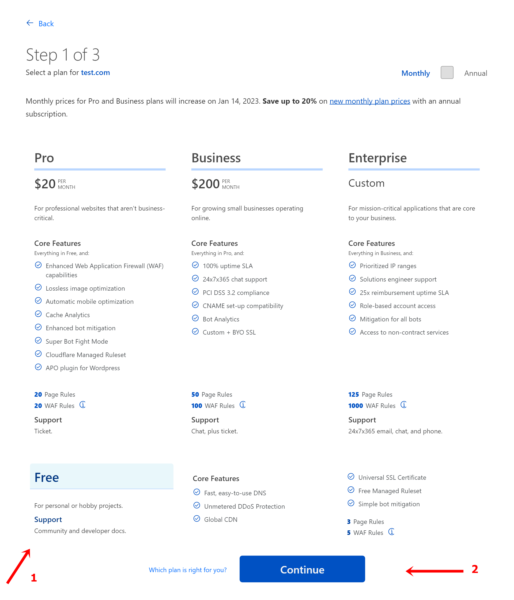

در پنجره بعدی DNS record های دامنه شما اسکن شده و اگر رکوردی ثبت شده باشد نشان داده می‌شود. روی `Continue` کلیک کنید.

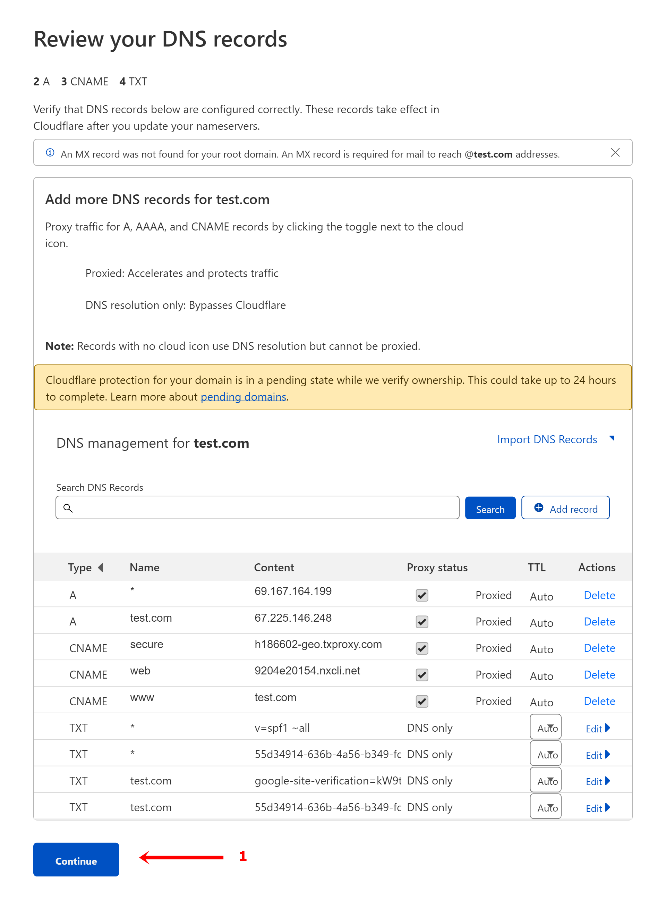

در پنجره بعدی نیم سرورهای فعلی شما نمایش داده می‌شود. شما باید به سایتی که دامنه را از آن خریداری کرده‌اید رفته و در آنجا نیم سرورهای فعلی را حذف کرده و نیم سرورهایی را که در عکس با شماره 1 مشخص شده جایگزین کنید. بعد از انجام این تغییرات در سایتی که دامنه را خریداری کرده‌اید، بر روی `Done, check nameservers` کلیک کنید.

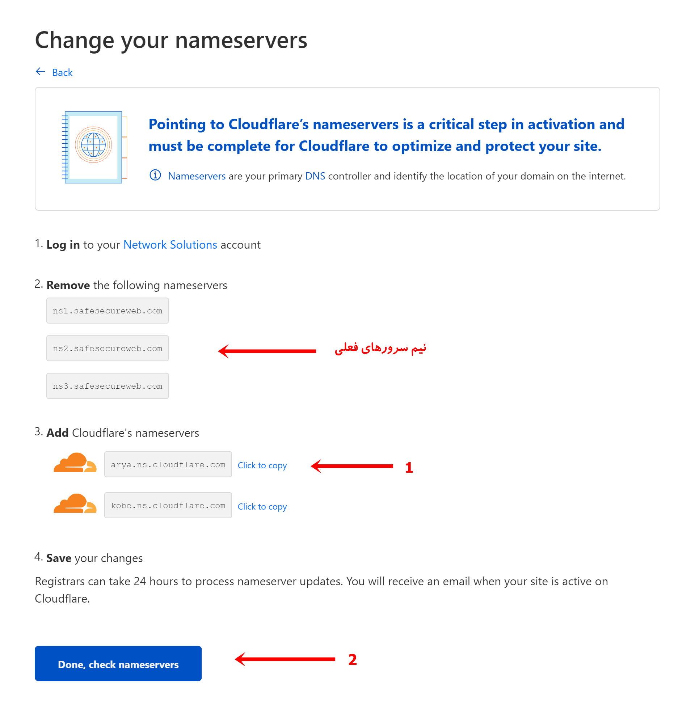

در پنجره بعدی `Automatic HTTPS Rewrites` را غیرفعال کرده و بر روی `Save`کلیک کنید. در نهایت بر روی `Summary` کلیک کنید.

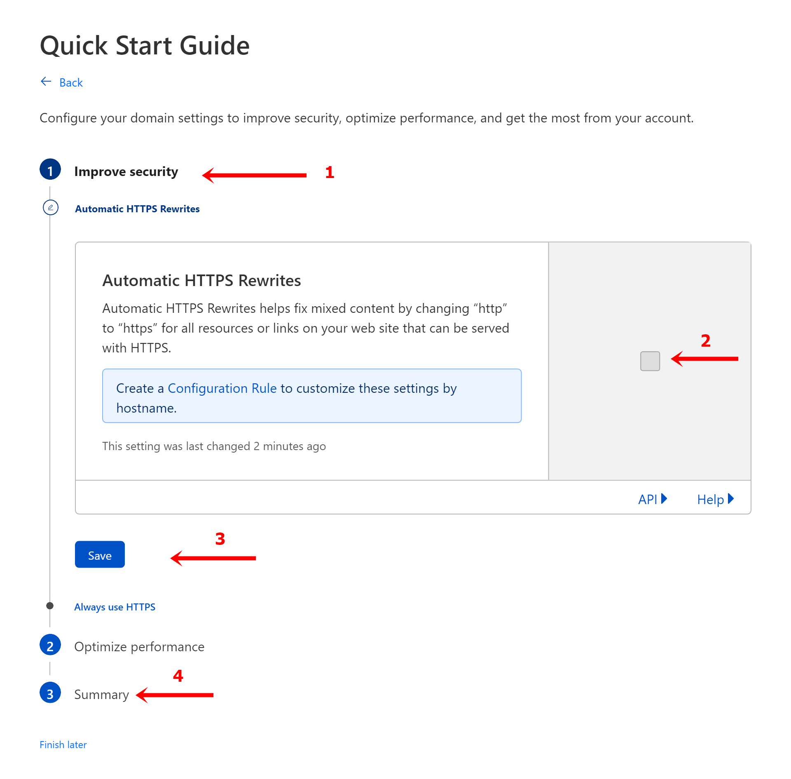

در مرحله بعد بر روی `Finish` کلیک کنید.

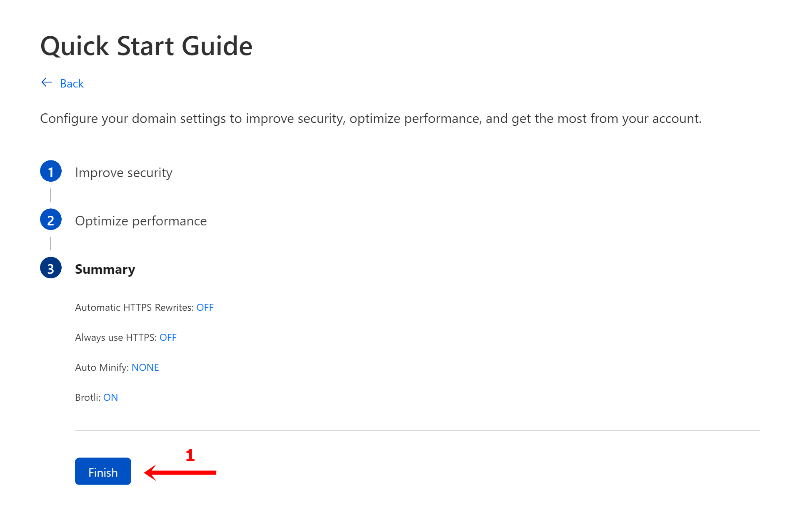

منتظر باشید تا نیم سرورهای شما تغییر کند. تغییر نیم سرورها از چند دقیقه تا چند ساعت بسته به سایتی که دامنه از آن خریداری شده ممکن است زمان ببرد. به داشبورد اصلی برگردید درصورت اعمال موفقیت‌آمیز نیم سرور ها دامنه شما از حالت `Pending Nameserver Update` به حالت `Active` درمی‌آید. در اینصورت روی دامنه خود کلیک کنید تا وارد پنل تنظیمات شوید. از آنجایی که من نمیخواهم دامنه ثبت شده توسط من مشخص باشد، دامنه خودم را پنهان کردم!

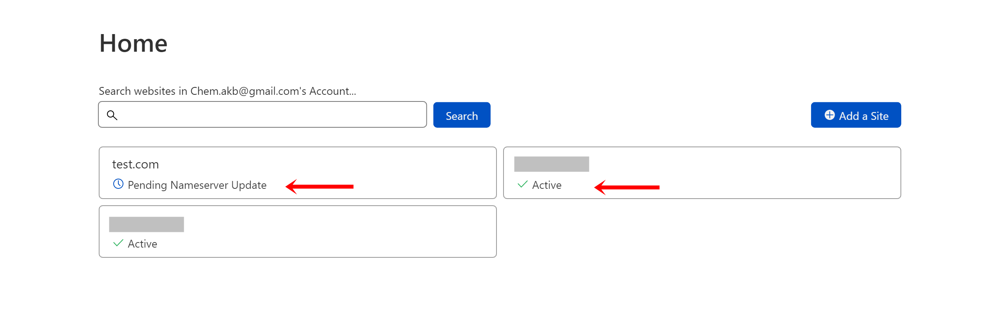

در پنجره باز شده از منوی کناری روی `SSL/TLS` کلیک کنید.

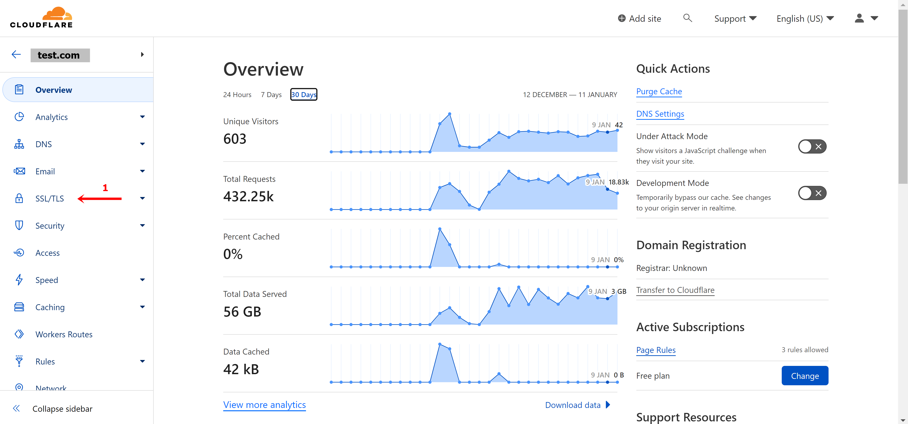

در پنجره باز شده ابتدا روی `Flexible` و سپس از پایین ستون سمت چپ روی `Network` کلیک کنید.

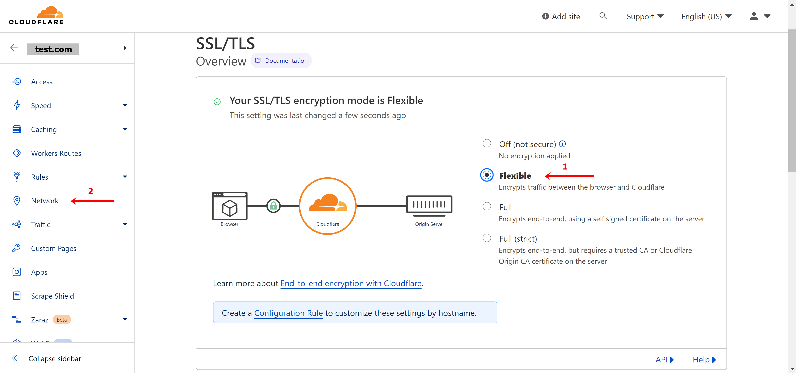

در پنجره باز شده `gRPC` و `WebSockets` را فعال کرده و از ستون سمت چپ بر روی `DNS` کلیک کنید.

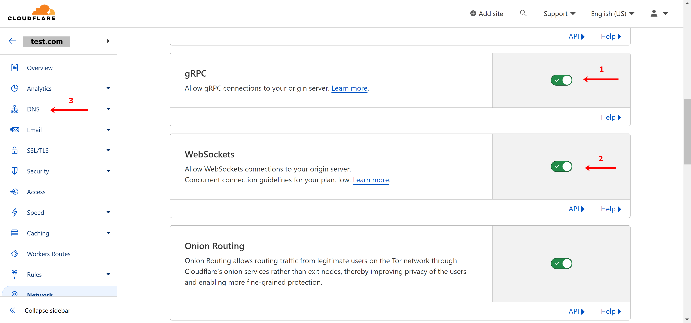

در اینجا ما دو سابدامین ایجاد میکنیم. یک سابدامین با رکورد A که مستقیم به ip سرور ما پوینت خواهد شد. من نام سابدامین اول را `sub.test.com` انتخاب میکنم. شما میتوانید اسم دلخواه خود را جایگزین کنید. بر روی `Add record` کلیک کنید.

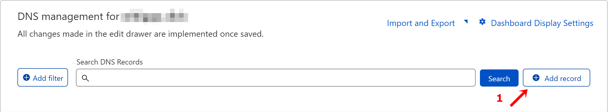

با فرض اینکه ip سرور شما `1.1.1.1` هست، ip خود را جایگزین کرده و مطابق عکس زیر موارد 1 تا 3 را پر کرده و مطابق شماره 4 پروکسی را خاموش کنید! در نهایت بر روی `Save` کلیک کرده و دوباره روی `Add record` کلیک کنید.

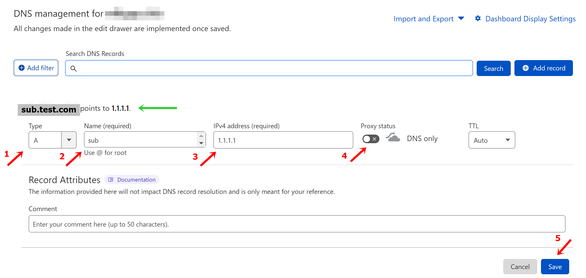

برای سابدامین دوم من `subcdn.test.com` را انتخاب میکنم شما میتوانید با نام دلخواه خودتان جایگزین کنید. شماره 1 را `CNAME`، شماره 2 را `subcdn`، شماره 3 را سابدامینی که در مرحله قبل ایجاد کردید وارد کنید و در شماره 4 پروکسی را روشن کنید. در نهایت بر روی `save` بزنید.

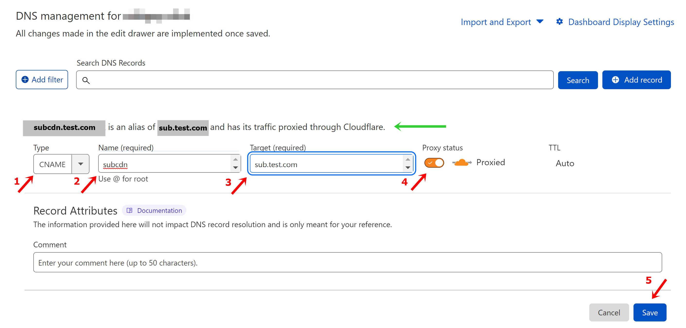

---

### نکات مهم

الان ما دو سابدامین داریم یکی مستقیم و بدون پروکسی به ip سرور پوینت شده است و یکی به سابدامین اول پوینت شده با این تفاوت که پروکسی فعال دارد.

1- اگر از CDN دیگری استفاده می‌کنید، به همین صورت دو سابدامین ایجاد کنید. این کار باعث می‌شود هنگام ساختن فیلترشکن دو انتخاب داشته باشیم. اگر در کلاینت به جای آدرس سابدامین اول را بزاریم مستقیم به سرور وصل میشیم و اگر سابدامین دوم را بزاریم از پروکسی CDN عبور میکنیم.

2- اگر از CDN دیگری استفاده میکنید، برای دریافت گواهی SSL در حالت standalone دیگر نیاز نیست پروکسی سابدامین خود را خاموش کنید.

3- برای استفاده از حالت پروکسی CDN در حالت http و https باید یکی از پورت‌های زیر را انتخاب کنید در غیر اینصورت پروکسی عمل نخواهد کرد و شما نمی‌توانید به فیلترشکن خود وصل بشوید.

| HTTP | HTTPS |
| :--: | :---: |
|  80  |  443  |
| 2052 | 2053  |
| 2082 | 2083  |
| 2086 | 2087  |
| 2095 | 2096  |
| 8080 | 8443  |
| 8880 |       |

4- در برخی اپراتورها در صورتی که سابدامین دوم را در آدرس قرار دهیم متصل نخواهد شد! در این حالت به جای آدرس میتوان یکی از آیپی‌های کلاودفلر را گذاشت و در قسمت `Host` و در صورت استفاده از tls، در قسمت `SNI` سابدامین دوم را. طبیعی هست که اگر کلاینت فیلترشکن ما یکی از این دو مورد را نداشته باشد، نمی‌توان از این ترفند استفاده کرد. در حال حاضر یکی از آیپی‌های `66.235.200.90` و `104.27.3.31` روی اپراتورها کار خواهد کرد.

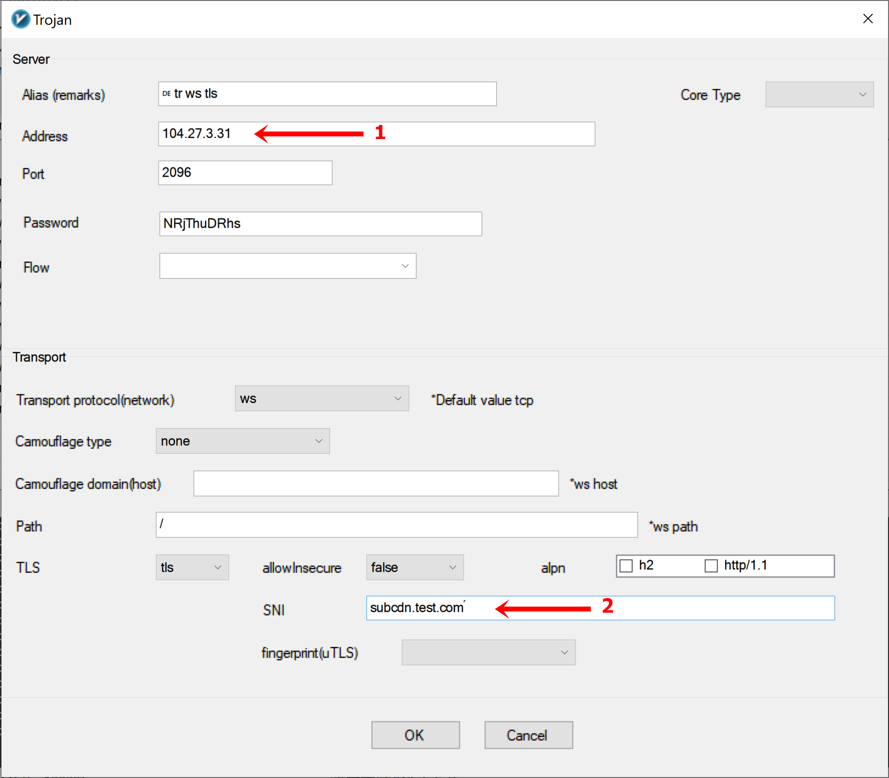

5- یک ترفندی که کارایی اون ثابت نشده اما خیلی ها استفاده میکنن برای اینکه دامنه دیرتر فیلتر بشه اینه که توی سابدامین از اسم دامنه‌های مشهور استفاده میکنن. مثلا در مثال ما سابدامین `arvancloud.ir.test.com` میسازن!!!

---

## دریافت API Token

برای دریافت گواهی SSL چند روش وجود دارد. در حالت `standalone` باید پورت 80 سرور آزاد باشد. در صورتی که شما از این پورت استفاده میکنید باید هنگام دریافت گواهی سرویس استفاده کننده را خاموش کنید و پس از دریافت گواهی دوباره فعال نمایید. همچنین در زمان تمدید گواهی باید دوباره این مراحل را تکرار کنید. اگر از کلاودفلر برای مدیریت دامنه خود استفاده کنید میتوان به وسیله `API Token` و `DNS Challenge` گواهی را دریافت کرد در این حالت دیگر لازم نیست پورت 80 آزاد باشد.

به داشبورد اصلی برگردید و مطابق عکس زیر وارد پروفایل خود شوید.

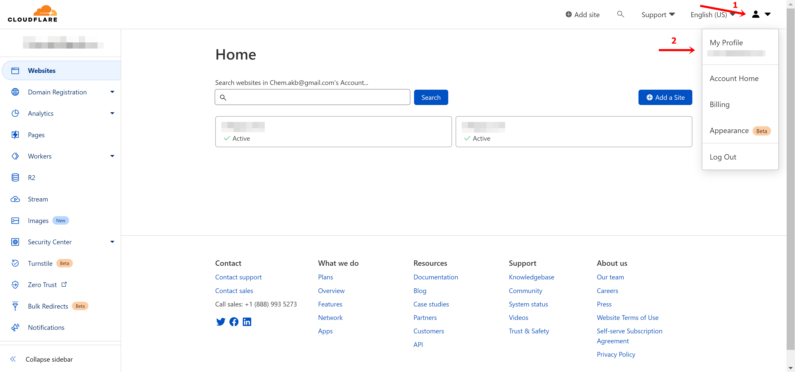

مطابق عکس زیر ابتدا روی `API Tokens` و سپس روی `Create Token` کلیک کنید.

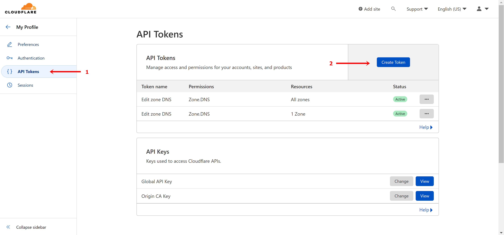

مطابق عکس زیر `Edit Zone DNS` را انتخاب کنید.

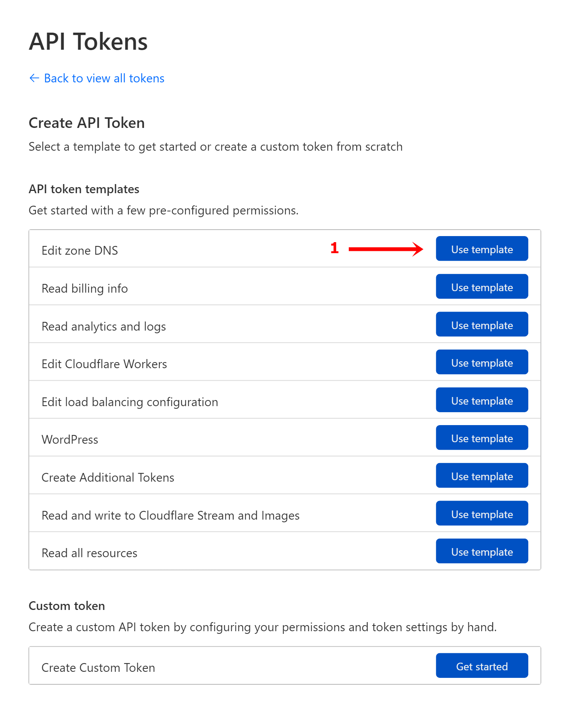

مطابق عکس زیر موارد 1 تا 5 را انتخاب کنید و در شماره 6 دامنه خود را انتخاب کرده و در نهایت روی شماره 7 کلیک کنید.

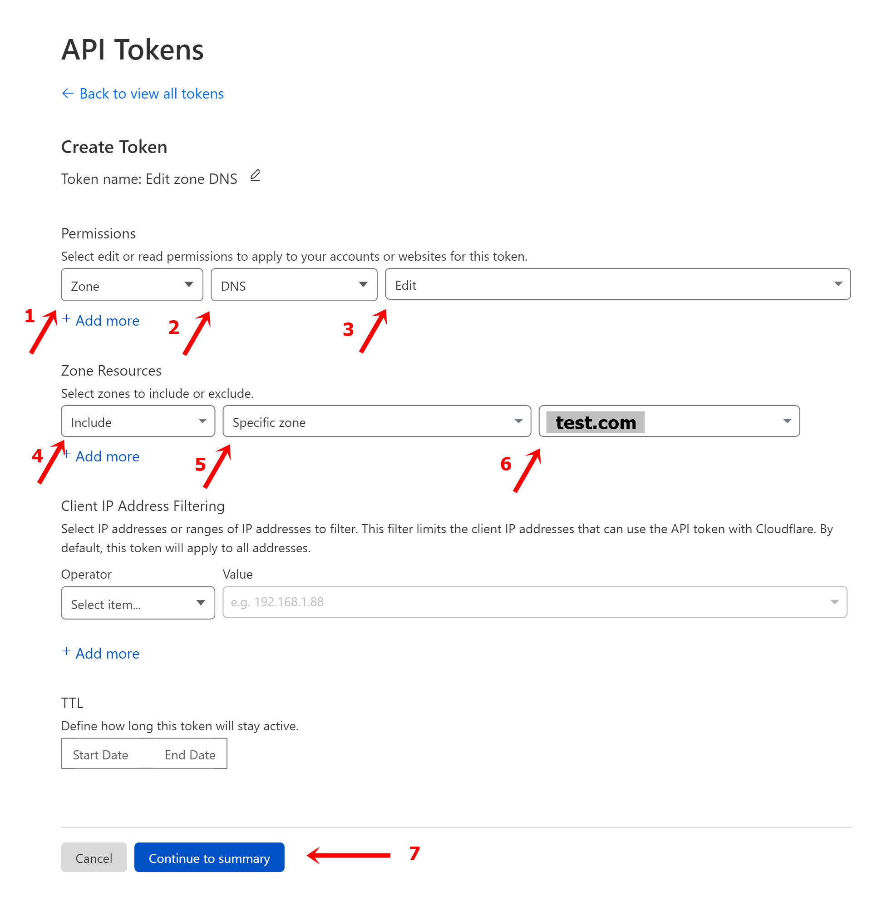

مطابق عکس زیر بر روی `Create Token` کلیک کنید.

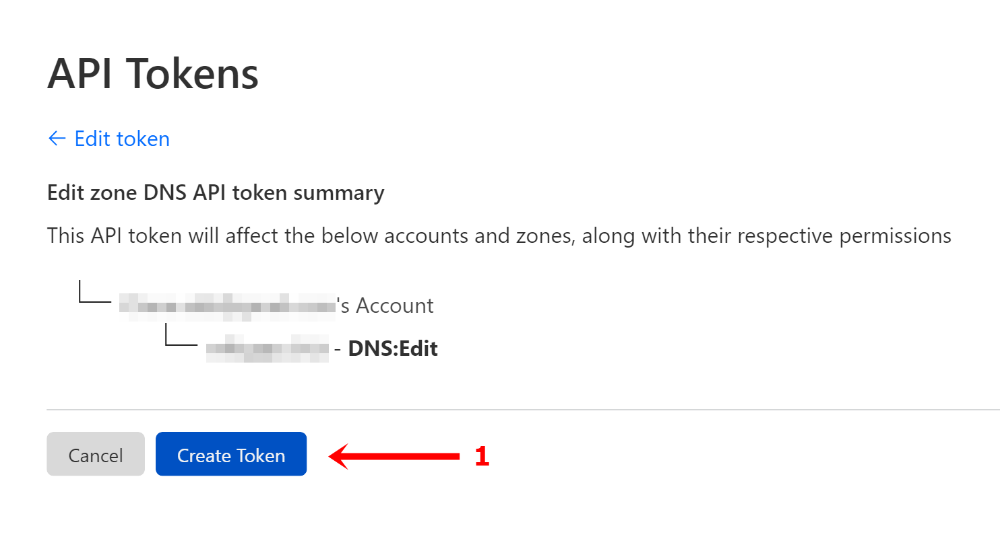

توکن خود را در جایی امن کپی کنید. در مرحله دریافت گواهی از آن استفاده میکنیم. دقت کنید در صورت گم کردن توکن دیگر امکان کپی کردن دوباره آن وجود ندارد و باید توکن جدید دریافت کنید.

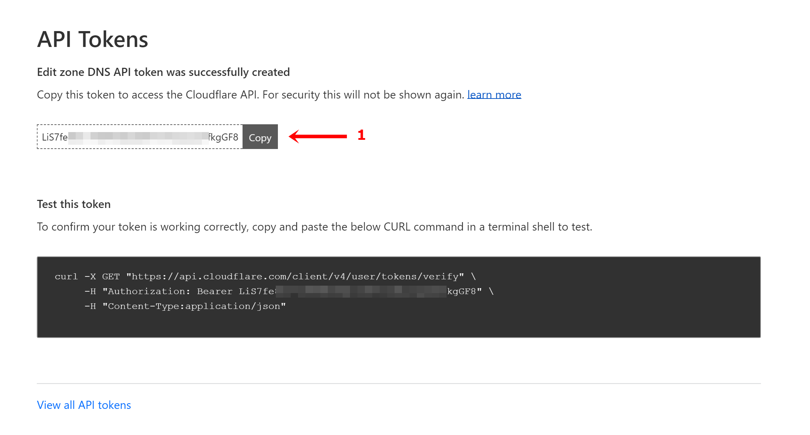

کارمان با سایت کلاودفلر تمام شد. موفق باشید
