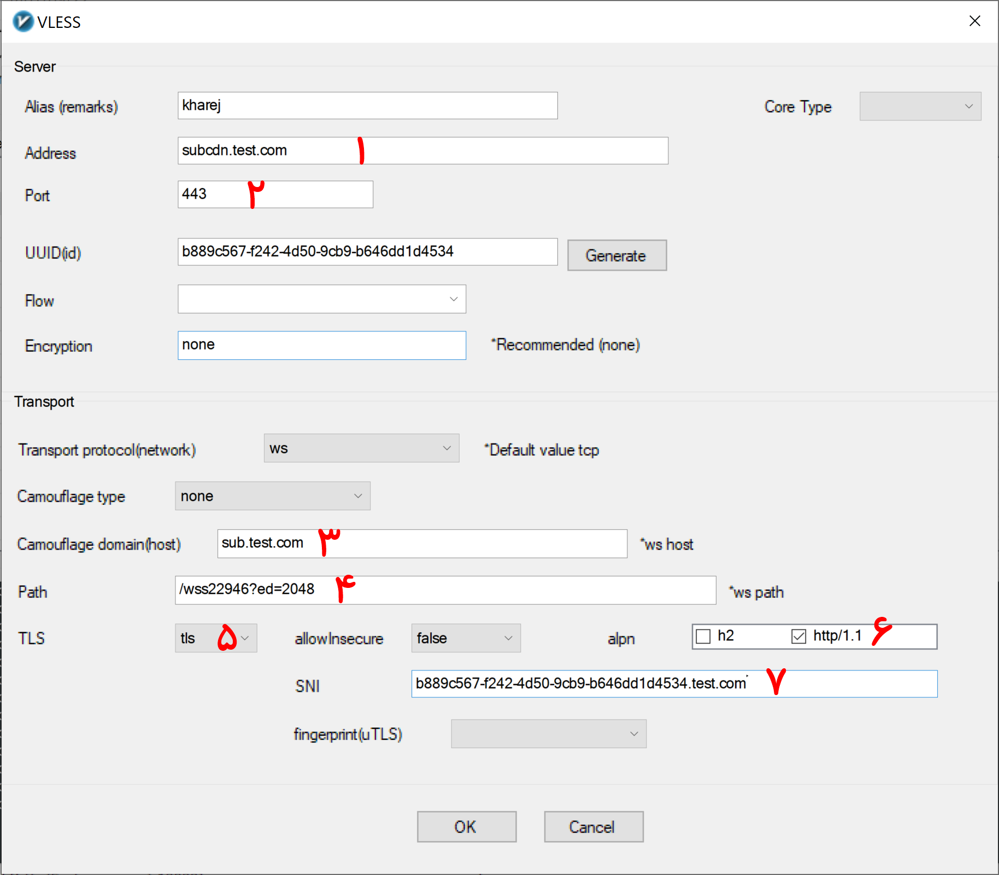
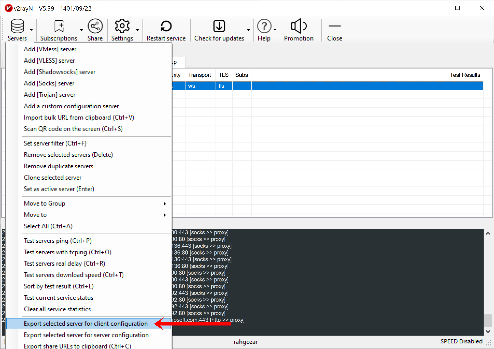
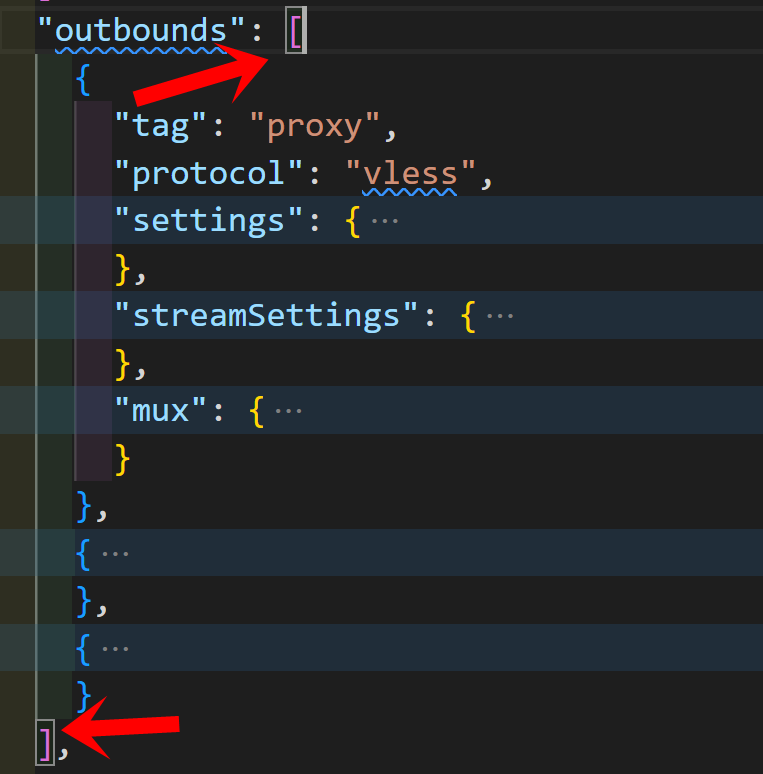
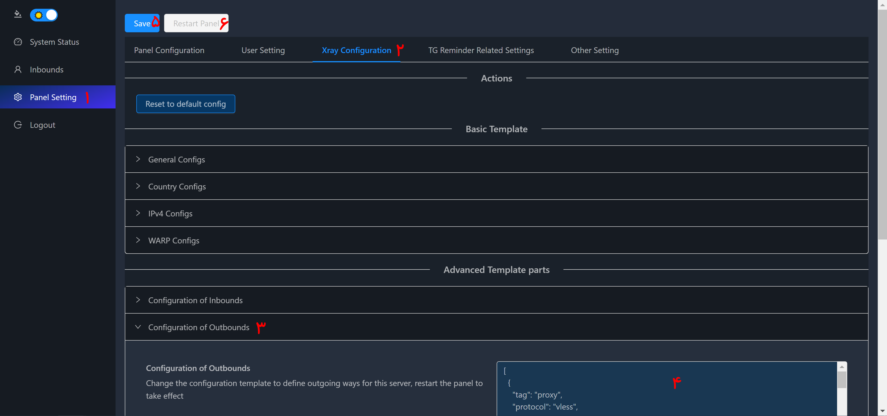

<div dir=auto>

# مقدمه

با توجه به اینکه محدودیت ها در سرورهای داخلی افزایش پیدا کرده و اکثر دیتاسنترهای  خارجی در سرورهای داخلی فیلتر هستن، عملا پورت فورواردینگ دچار مشکل شده و برای داشتن یک تانل مطلوب نیازمند این هستیم تا سروری پیدا کنیم که آیپی آن در سرور داخلی ما فیلترنشده باشد که کار سختی است. اگر موفق به پیدا کردن سرور خارجی طبق توضیحات شدیم، باز هم احتمال فیلتر شدن آن دور از انتظار نیست. به همین منظور قصد دارم روشی را آموزش بدم که حتی در صورت فیلتر بودن سرور خارجی باز بتوان از سرور داخلی تانل زد.

نکته بسیار مهم: مشاهده شده که براساس آموزش های غلط، یک عده عمل پورت فورواردینگ را به یکی از آیپی های کلاودفلر انجام میدهند. در صورت انجام اینکار با اسکنری که در ادامه بحث معرفی میکنم به راحتی سرور شما قابل شناسایی بوده و میتواند مورد سو استفاده قرار بگیرد. این کار عواقب زیر را برای شما میتواند داشته باشد:

- تقریبا تمام سرورها ترافیک محدودی دارند، در اینصورت اشخاص دیگر میتوانند از ترافیک شما استفاده کنند و بار مالی برای شما داشته باشد
- تمام سرور ها قدرت سخت افزاری محدودی دارند، اینکار باعث افت کیفیت سرور شما میشود
- در صورتی که در سرور ایران اینکار را انجام دهید عواقب خطرناک تری برای شما خواهد داشت، چون با افزایش ترافیک سرور ایران، شما مسئول هستید و باید پاسخگو باشید نه فرد سواستفاده کننده.

بنابراین توصیه اکید میکنم از آموزش های افراد معتبر استفاده کنید.

# مرحله اول

یک سرور خارجی نیاز داریم که دقیقا طبق آموزش همین ریپو راه اندازی کردید. در پنل سرور خارجی یک اینباند ایجاد کنید با تاریخ و حجم نامحدود. فقط از پروتکل های موجود در آموزش میتوانید استفاده کنید. بعد از ساختن اینباند آن را مطابق آموزش در کلاینت وارد کرده و اطلاعات موردنیاز را ویرایش کنید. ( مثل اینکه قصد دارید به عنوان فیلتر شکن از آن استفاده کنید.) فقط در قسمت آدرس، دامنه subcdn.test.com را وارد کنید.

# مرحله دوم

## کلاودفلر

در کلاودفلر با دامنه فعلی خودتان که در مرحله اول طبق آموزش تنظیمات آن را انجام داده اید، در قسمت DNS یک A رکورد به آدرس آیپی ایران ایجاد کنید با پروکسی خاموش! ما این دامنه را در آموزش ir.test.com در نظر میگیریم.

## سرور ایران

در سرور ایران مطابق آموزش به طور کامل یک پنل راه اندازی کنید. هم قسمت آماده سازی سرور، هم قسمت انجین ایکس و هم قسمت پنل x-ui.

### انتقال یوزرها به سرور ایران

توجه کنید اگر در سرور خارج یوزر دارید این مرحله را انجام بدهید در غیر اینصورت از تیتر بعدی ادامه دهید.

برای اینکه یوزرهای فلی شما بتوانند از تانل استفاده کنند و نیازی به ایجاد دوباره یوزرها نباشد، این کار را انجام میدهیم. فقط دقت داشته باشید ترتیب مراحل مهم است. یعنی انتقال یوزرها اگر در این قسمت انجام نشود نتیجه مناسب نمیگیرید.

برای اینکار در سرور خارج فایل x-ui.db را از مسیر زیر کپی کنید و به همین مسیر در سرور ایران انتقال داده و جایگزین کنید.

```bash
/opt/freedom/x-ui/db/x-ui.db
```

قبل از کپی کردن در هر دو سرور ایران و خارج ابتدا با دستور زیر پنل را خاموش کنید

```bash
docker-compose down
```

و بعد از انتقال و جایگزینی با دستور زیر در هر دو سرور پنل را مجدد راه اندازی کنید

```bash
docker-compose up -d
```

با این کار شما تمام یوزرهای خود را همراه با تاریخ و حجم های مصرفی به سرور ایران منتقل کرده اید.

## آماده سازی لینک سرور خارج

<p align="center">
    
    </img>
</p>

اینباندی که در سرور خارج ایجاد کردید مطابق آموزش اصلی و شکل زیر ویرایش کنید فقط:
  
- درشماره یک سابدامین پروکسی شده قرار دهید
- در شماره سه سابدامین مستقیم
- در شماره هفت سابدامین رندم

<p align="center">
    
    </img>
</p>

مطابق تصویر فوق روی لینک اینباند سرور خارج راست کلیک کرده و به وسیله گزینه مشخص شده  کانفیگ کلاینت سرور خارج را در مسیری ذخیره کنید.

<p align="center">
    
    </img>
</p>

فایل جیسونی که ذخیره کردید باز کنید. داخل این فایل ما قسمت outbounds را نیاز داریم. دقت کنید که باید براکت هایی که در تصویر فوق مشخص شده است را همراه با محتوای داخلشان کپی کنید. در نهایت متنی که کپی کرده اید شبیه متن زیر خواهد بود.

```json
[
    {
      "tag": "proxy",
      "protocol": "vless",
      "settings": {
        "vnext": [
          {
            "address": "subcdn.test.com",
            "port": 443,
            "users": [
              {
                "id": "b889c567-f242-4d50-9cb9-b646dd1d4534",
                "alterId": 0,
                "email": "t@t.tt",
                "security": "auto",
                "encryption": "none",
                "flow": ""
              }
            ]
          }
        ]
      },
      "streamSettings": {
        "network": "ws",
        "security": "tls",
        "tlsSettings": {
          "allowInsecure": false,
          "serverName": "b889c567-f242-4d50-9cb9-b646dd1d4534.test.com",
          "alpn": [
            "http/1.1"
          ],
          "fingerprint": ""
        },
        "wsSettings": {
          "path": "/wss22946?ed=2048",
          "headers": {
            "Host": "sub.test.com"
          }
        }
      },
      "mux": {
        "enabled": false,
        "concurrency": -1
      }
    },
    {
      "tag": "direct",
      "protocol": "freedom",
      "settings": {}
    },
    {
      "tag": "block",
      "protocol": "blackhole",
      "settings": {
        "response": {
          "type": "http"
        }
      }
    }
  ]
```

## تغییر کانفیگ پنل سرور ایران

<p align="center">
    
    </img>
</p>

من در این آموزش از پنل سنایی استفاده میکنم. مطابق تصویر فوق متنی را که در مرحله قبل کپی کردید، در قسمت شماره 4 جایگزین کنید و سپس با زدن به ترتیب کلید های 5 و 6 تغییرات را ذخیره کرده و پنل را ریستارت کنید.

توجه: اگر پنل شما سنایی نبود،باید متن فوق را در قسمت outbounds جایگزین کنید.

کار ما در اینجا تمام است. از این به بعد شما یوزرهای خود را در پنل ایران ایجاد میکنید و طبق آموزش اصلی باید عمل کنید.

اگر یوزرهای خود را انتقال داده اید باید در لینک آنها آدرس و هاست و sni را مطابق آموزش اصلی به سابدامین ایران تغییر دهید.

## بهبود سرعت

ممکن است سابدامین پروکسی شده سرور خارج شما، در سرور ایران سرعت مطلوبی نداشته باشد. بنابراین نیاز است تا با اسکن آیپی های کلاودفلر، آیپی مناسبی پیدا کرده و در قسمت کانفیگ ایکس ری در پنل سرور ایران که در مرحله قبل تغییر دادیم، جایگزین سابدامین پروکسی شده سرور خارج بکنید.

برای این منظور از هر اسکنری که مایل هستید میتوانید استفاده بکنید. من اسکنر زیر را پیشنهاد میکنم. ابتدا از [این لینک](https://github.com/XIU2/CloudflareSpeedTest/releases)، لینک آخرین نسخه متناسب با سیپیو سرور خود انتخاب کنید. معمولا نسخه amd64 هست.

نسخه فعلی 2.2.3 میباشد. در صورت تغییر لینک را در دستورات زیر جایگزین کنید. دستورات زیر را را به ترتیب اجرا کنید:

```bash
cd
mkdir -p cftest
cd cftest
wget https://github.com/XIU2/CloudflareSpeedTest/releases/download/v2.2.3/CloudflareST_linux_amd64.tar.gz
tar -xzvf CloudflareST_linux*
```

با دستور زیر اسکن را انجام میدهیم

```bash
./CloudflareST -n 50 -dn 20 -sl 80 -tl 200 -httping -o natijeh.csv
```

اگر دستور بالا هیچ نتیجه ای نداد از این دستور استفاده کنید

```bash
./CloudflareST -n 50 -dn 20 -sl 80 -tl 200 -httping -url https://speed.cloudflare.com/__down?bytes=200000000 -o natijeh.csv
```

بعد از تمام شدن اسکن، حداکثر 10 آیپی با بهترین نتیجه نمایش داده میشود. لازم است آیپی ها را یک به یک تست کنید.

- بسته به دیتاسنتر سرور داخلی شما، ممکن است در اسکن اول ایپی مناسبی پیدا نشده و بدون خروجی اسکن تمام شود. در اینصورت حداقل 20 بار اسکن را انجام دهید و اگر نتیجه حاصل نشد در دستور فوق فقط مقدار sl را کم کنید.
- در صورتی که بعد از مدتی سرعت کاهش پیدا کرد و یا آیپی که استفاده میکنید فیلتر شد، دوباره با اسکن کردن ایپی جدید پیدا کنید.

##### دونیت

اگر آموزش بنده به شما کمک میکند و یا اگر از آموزش بنده کسب درآمد میکنید، با دونیت کردن مبلغی به صورت ماهانه امکان ادامه فعالیت بنده را فراهم میکنید.

[لینک دونیت](../donate.md)


</div>
