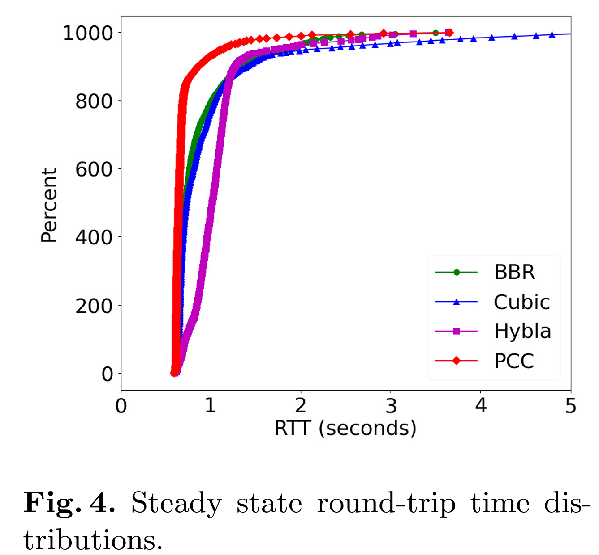
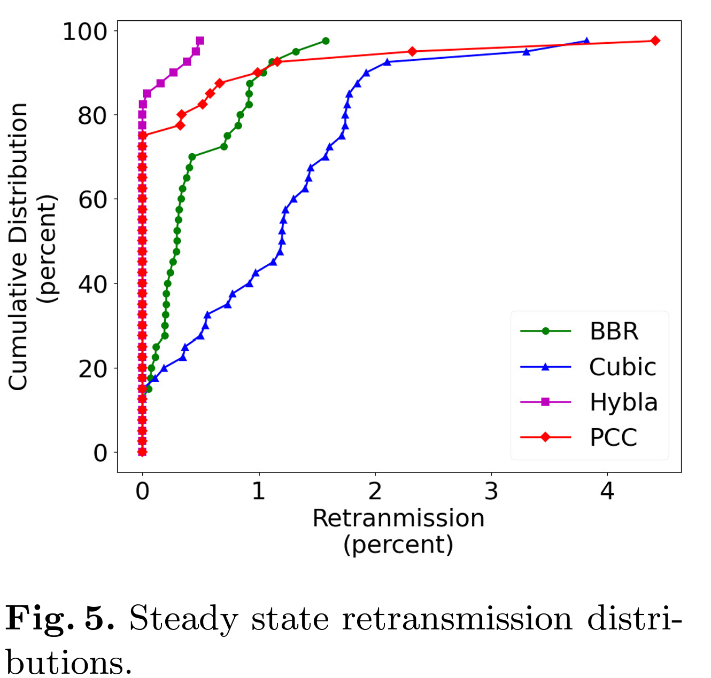
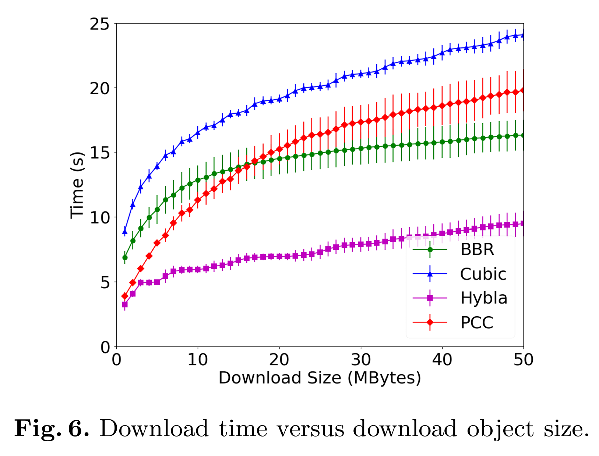

# تنظیمات اولیه سرور

در ابتدا بعد از خریداری سرور باید یک سری کارهای اولیه انجام بگیرد. تمامی آموزش‌ها بر اساس `ubuntu 20.04` و `ubuntu 22.04` است. همچنین در تمام آموزش از یوزر `root` استفاده میکنیم. اگر یوزر شما غیر از این بود به ابتدای تمامی دستورات عبارت `sudo` را اضافه کنید!

---

## تغییر پورت پیشفرض SSH

به دلیل مشکلات اخیر و همچنین برای افزایش امنیت سرور و جلوگیری از کرک شدن آن توصیه می‌شود پورت پیشفرض سرور را تغییر بدهید. برای این منظور دستور زیر را در ترمینال سرور وارد کنید:

```bash
nano /etc/ssh/sshd_config
```

به وسیله دکمه‌های بالا و پایین کیبورد به خط زیر بیاید:

```conf
#Port 22
```

علامت # اول خط را حذف کرده و عدد 22 را به پورت دلخواه خود تغییر دهید. پیشنهاد میکنم یک عدد چهار رقمی انتخاب کنید. به عنوان مثال:

```conf
Port 4256
```

بعد از انجام تغییرات دکمه‌های `ctrl + x` و `y` و `enter` را بزنید تا تغییرات ذخیره شده و فایل بسته شود. سپس دستور زیر را در ترمینال وارد کنید:

```bash
systemctl reload sshd
```

حالا یک ترمینال با پورت تغییر یافته باز کنید، اگر ترمینال باز شد ترمینال قبلی را ببندید و مرحله بعدی را انجام بدهید اما اگر ترمینال جدید باز نشد در ترمینال قبلی بار دیگر مرال بالا را چک کنید.

---

## آپدیت سرور و نصب برنامه‌های مورد نیاز

با دستور زیر سرور را آپدیت کنید.

```bash
sh -c 'apt-get update; apt-get upgrade -y; apt-get dist-upgrade -y; apt-get autoremove -y; apt-get autoclean -y'
```

در طول آپدیت هر سوالی شد با زدن دکمه `enter` حالت پیشفرض را انتخاب کنید.

با زدن دستور زیر در ترمینال برنامه‌های مورد نیاز را نصب کنید:

```bash
apt-get install -y software-properties-common ufw wget curl git socat cron busybox bash-completion locales nano apt-utils
```

---

## تنظیمات فایروال

دستورات زیر را به ترتیب وارد کنید و به جای `sshPort` پورتی را که در مرحله قبل به ssh اختصاص دادید قرار دهید.

```bash
ufw default deny incoming
```

```bash
ufw default allow outgoing
```

```bash
ufw limit sshPort
```

```bash
echo y | ufw enable
```

---

## بهینه‌سازی سرور

دستور زیر را اجرا کنید:

```bash
nano /etc/security/limits.conf
```

دو خط زیر را به انتهای فایل باز شده اضافه کنید.

```conf
* soft nofile 51200
* hard nofile 51200
```

به ترتیب با زدن دکمه‌های `ctrl + x` و `y` و `enter` تغییرات را ذخیره کرده و فایل را ببندید.

دستور زیر را اجرا کنید:

```bash
ulimit -n 51200
```

به جای BBR از Hybla استفاده میکنیم که بازدهی به مراتب بیشتری از BBR دارد.

<p align="center">
    
    </img>
    
    </img>
    
    </img>
</p>
دستور زیر را اجرا کنید:

```bash
nano /etc/ufw/sysctl.conf
```

خطوط زیر را در انتهای فایل اضافه کنید:

```conf
fs.file-max = 51200
net.core.rmem_max = 67108864
net.core.wmem_max = 67108864
net.core.netdev_max_backlog = 250000
net.core.somaxconn = 4096
net.ipv4.tcp_syncookies = 1
net.ipv4.tcp_tw_reuse = 1
net.ipv4.tcp_tw_recycle = 0
net.ipv4.tcp_fin_timeout = 30
net.ipv4.tcp_keepalive_time = 1200
net.ipv4.ip_local_port_range = 10000 65000
net.ipv4.tcp_max_syn_backlog = 8192
net.ipv4.tcp_max_tw_buckets = 5000
net.ipv4.tcp_fastopen = 3
net.ipv4.tcp_mem = 25600 51200 102400
net.ipv4.tcp_rmem = 4096 87380 67108864
net.ipv4.tcp_wmem = 4096 65536 67108864
net.ipv4.tcp_mtu_probing = 1
net.ipv4.tcp_congestion_control = hybla

```

---

## نصب docker و docker-compose

برای نصب آسان و سریع سرویس‌های مورد نیاز و همچنین نصب چندین سرویس بدون اینکه تداخلی با هم داشته باشند ما در این آموزش از داکر استفاده میکنیم. با دستور زیر داکر را نصب کنید:

```bash
wget --quiet get.docker.com -O docker-setup.sh && sh docker-setup.sh
```

برای نصب docker-compose دستورات زیر را به ترتیب اجرا کنید:

```bash
LATEST_VERSION=$(curl --silent "https://api.github.com/repos/docker/compose/releases/latest" | grep '"tag_name":' | sed -E 's/.*"([^"]+)".*/\1/')
```

```bash
curl -L "https://github.com/docker/compose/releases/download/${LATEST_VERSION}/docker-compose-$(uname -s)-$(uname -m)" -o /usr/local/bin/docker-compose
```

```bash
chmod +x /usr/local/bin/docker-compose
```

---

## نصب اسکریپت acme.sh

برای دریافت گواهی ssl از اسکریپت acme.sh استفاده میکنیم. در دستورات زیر به جای `my@email.com` ایمیل خود را جایگزین کرده و دستورات را به ترتیب اجرا کنید:

```bash
curl https://get.acme.sh | sh -s email=my@email.com
```

```bash
source  ~/.bashrc
```

```bash
acme.sh --set-default-ca --server letsencrypt
```

```bash
acme.sh --register-account -m my@email.com
```

```bash
acme.sh --upgrade --auto-upgrade
```

---

در نهایت با دستور زیر سرور را ریبوت میکنیم:

```bash
shutdown -r now
```


