

# آموزش ساخت سابسکرایب لینک

با ایجاد ساب لینک و دادن آن به یوزرها تغییرات احتمالی بعدی در لینک ها به آسانی انجام میشود. در اینصورت یوزرها ساب لینک را در کلاینت خود وارد میکنند و در صورت تغییر در لینک ها، با آپدیت کردن ساب لینک لینک های جدید را دریافت میکنند.

## هاست و دامنه

برای اینکار شما نیاز به یک هاست دارید و یک دامنه که به هاست شما پوینت شده باشد. ترجیحا توصیه میشود هاست خود را روی سروری که فیلترشکن روی آن راه اندازی شده، نسازید. همچنین توصیه میشود برای جلوگیری از فیلتر شدن هاست خود، حتما از سرورهای ایرانی استفاده کنید. چون کاربری که قصد استفاده از فیلترشکن دارد، فرض بر این است که قبل از اینکه لینک های شما را دریافت کند، به اینترنت آزاد دسترسی ندارد. برای این منظور برای شما سه پیشنهاد داریم که یکی را که به نظرمان بهتر از بقیه هست آموزش میدهیم.

- استفاده از هاست ارزان ایرانی. میتوانید از سایت های فروش هاست، یک هاست ارزان قیمت تهیه کرده و فایل های خود را روی آن آپلود کنید.
- استفاده از سرور ایرانی. یک سرور از سرویس دهنده های ایرانی خریداری میکنید و روی آن با نصب یک وبسرور ساده، فایل های خود را آپلود میکنید
- استفاده از استوریج رایگان آروان. در قسمت بعد آموزش این مورد را با هم دنبال میکنیم

### صندوقچه آروان

در این آموزش ما قصد داریم از هاست دانلود آروان استفاده کنیم. آروان در لحظه تنظیم این آموزش، در پلن رایگان هاست دانلود خود، 5 گیگ فضای ذخیره سازی و 20 گیگ ترافیک ماهانه به شما اختصاص میدهد. این میزان برای مصرف ما کافی است.

#### دامنه

الزامی برای داشتن دامنه در این روش نیست اما اکیدا توصیه میکنم یک دامنه خریداری کرده و در قسمت CDN آروان ثبت کنید.

#### ایجاد صندوقچه

    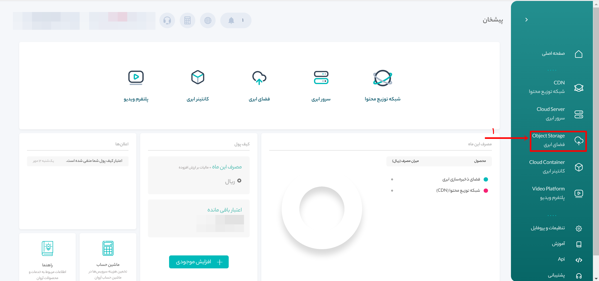
    </img>

وارد حساب کاربری خود در آروان شوید و طبق تصویر بالا، روی فضای ابری کلیک کنید.

    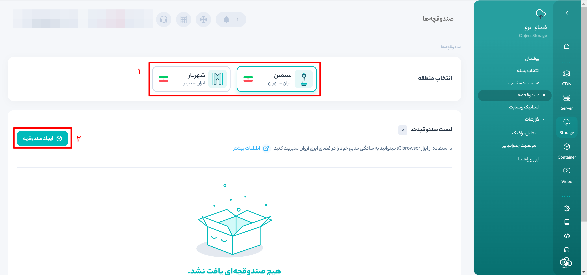
    </img>

در کادر شماره یک دیتاسنتر دلخواه خود را انتخاب کنید و سپس در کادر شماره 2 روی ایجاد صندوقچه کلیک کنید.

    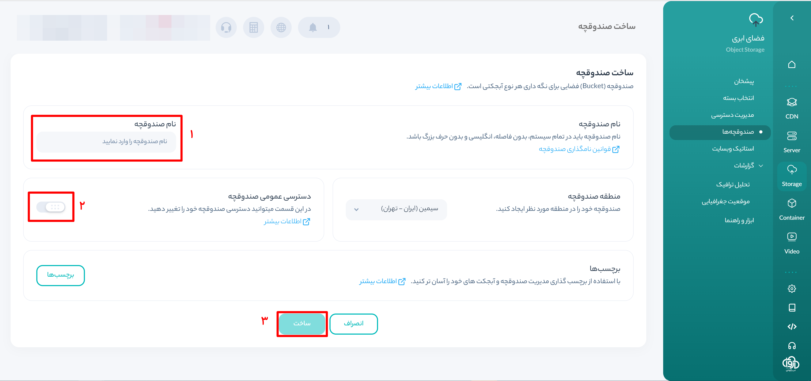
    </img>

در کادر شماره 1 باید یک نام یکتا برای صندوقچه خود انتخاب کنید. نام انتخابی باید به حروف انگلیسی بوده و تماما از حروف کوچک باشد.
در کادر شماره 2، حتما دسترسی عمومی به صندوقچه را فعال کنید
در نهایت در کادر شماره 3، روی ساخت کلیک کنید.

    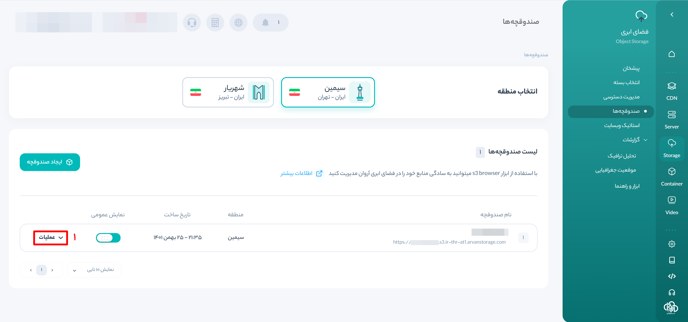
    </img>

در کادر شماره 1 روی عملیات کلیک کرده و از منوی باز شونده "استاتیک وبسایت" را انتخاب کنید.

    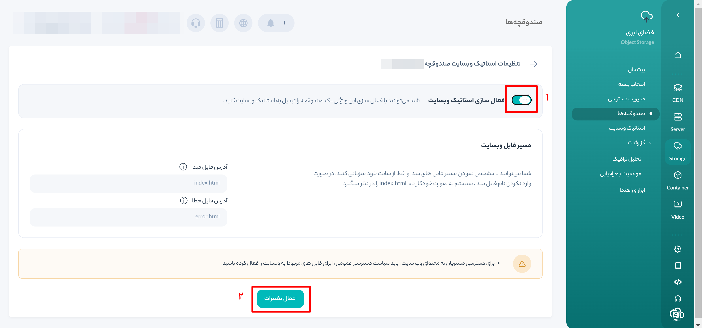
    </img>

در کادر شماره 1، "فعال سازی استاتیک وبسایت" را فعال کنید و سپس در کادر شماره 2 بر روی اعمال تغییرات کلیک کنید.

    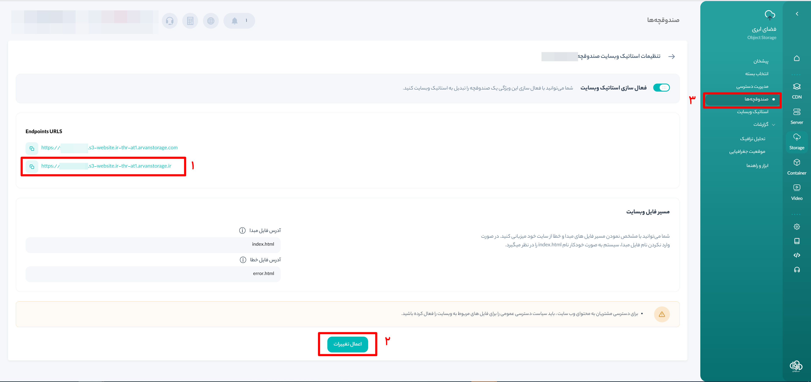
    </img>

در کادر شماره 1، دامنه ir رایگان اختصاص داده شده به هاست خود را میتوانید ببینید. اگر دامنه اختصاصی نداشته باشید میتوانید از این لینک استفاده کنید.
ابتدا روی کادر شماره 2 کلیک کنید و سپس با کلیک بر کادر شماره 3، به صفحه صندوقچه ها برگردید.

    
    </img>

در این مرحله سابدامین اختصاصی خود را اضافه میکنیم. اگر شما قصد استفاده از سابدامین اختصاصی ندارید، این مرحله را انجام ندهید.
در تصویر فوق در کادر شماره 1، روی عملیات کلیک کرده و از منوی بازشونده "تعریف دامنه اختصاصی" را انتخاب کنید.

    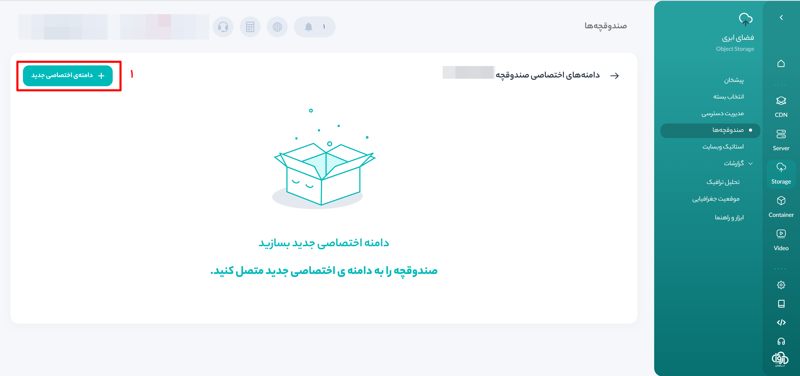
    </img>

بر روی کادر شماره 1، کلیک کنید!

    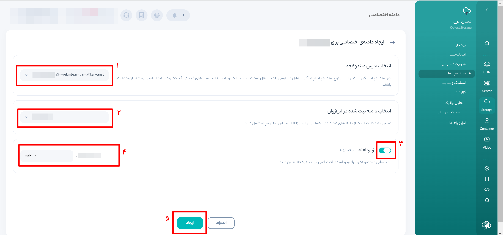
    </img>

در کادر شماره1، باید دامنه ir را که در مراحل قبل در قسمت استاتیک وبسایت دیدید، انتخاب کنید. ( لطفا دقت کنید!!! )
در کادر شماره 2، دامنه ای را که در پنل CDN اروان ثبت کرده اید انتخاب کنید.
در کادر شماره 3، زیردامنه ( سابدامین! ) را فعال کنید.
در کادر شماره 4، یک زیردامنه دلخواه برای خود انتخاب کنید. در اینجا من `sublink` انتخاب کردم. در صورتی که دامنه ثبت شده من `test2.com` باشد، آدرس لینک های سابسکرایب من به صورت `https://sublink.test2.com` خواهد شد.
در نهایت در کادر شماره 5، بر روی ایجاد کلیک کنید.

    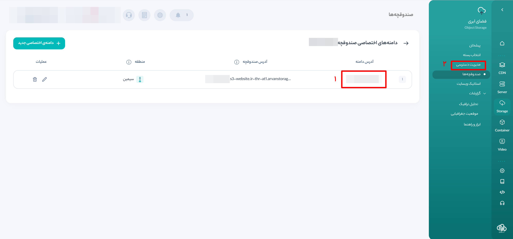
    </img>

هاست شما با موفقیت ساخته شد و آماده استفاده هست.
در کادر شماره 1، آدرس هاست خود را مشاهده میکنید.
در کادر شماره 2، روی "مدیریت دسترسی" کلیک کنید.

    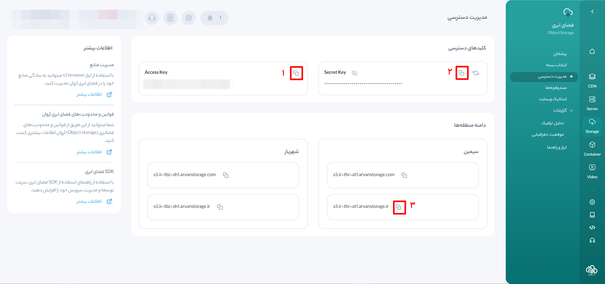
    </img>

در عکس فوق با کلیک بر روی کادرهای شماره 1 و 2 و 3، به ترتیب اکسس کی و سکرت کی و آدرسی را که برای اتصال نیاز دارید کپی کنید. دقت کنید از هر دیتاسنتری استفاده کردید، آدرس ir همان دیتا سنتر را انتخاب کنید. در این آموزش ما از دیتاسنتر سیمین استفاده کردیم.

#### ایجاد سابلینک

برای مدیریت هاست دانلود ابتدا از سایت [s3browser.com](https://s3browser.com) آخرین نسخه نرم افزار `s3browser` را دانلود کرده و در سیستم خود نصب و اجرا کنید.

    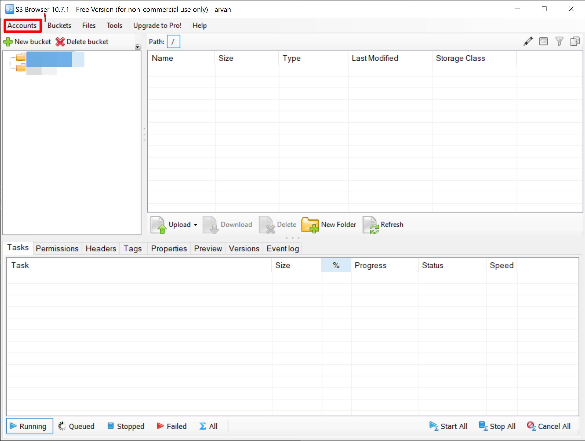
    </img>

در پنجره باز شده در کادر شماره 1، بر روی `Accounts` کلیک کرده و از منوی باز شونده، `Add New Account` کلیک کنید.

    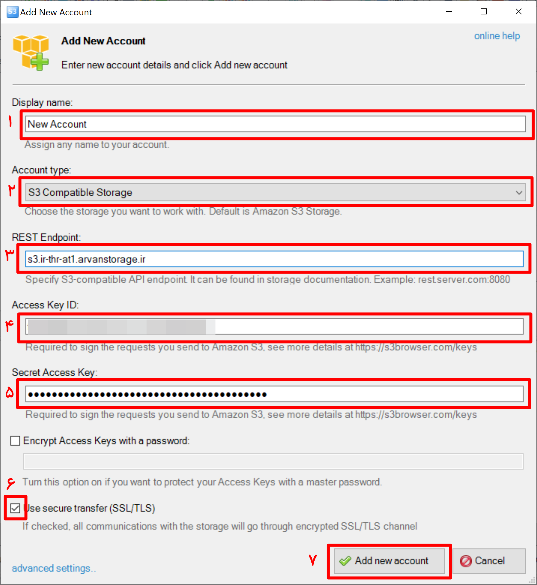
    </img>

در کادر شماره 1، یک نام دلخواه برای اکانت خود انتخاب کنید.
در کادر شماره 2، از منوی باز شونده گزینه `S3 Compatible Storage` را انتخاب کنید
در کادر شماره 3، آدرسی را که در قسمت "مدیریت دسترسی" کپی کردید، جایگذاری کنید.
در کادر شماره 4، اکسس کی را که در قسمت "مدیریت دسترسی" کپی کردید، جایگذاری کنید.
در کادر شماره 5، سکرت کی را که در قسمت "مدیریت دسترسی" کپی کردید، جایگذاری کنید.
در کادر شماره 6، تیک گزینه فعال باشد.
در نهایت با کلیک بر روی کادر شماره 7، اکانت خود را اضافه کنید.

    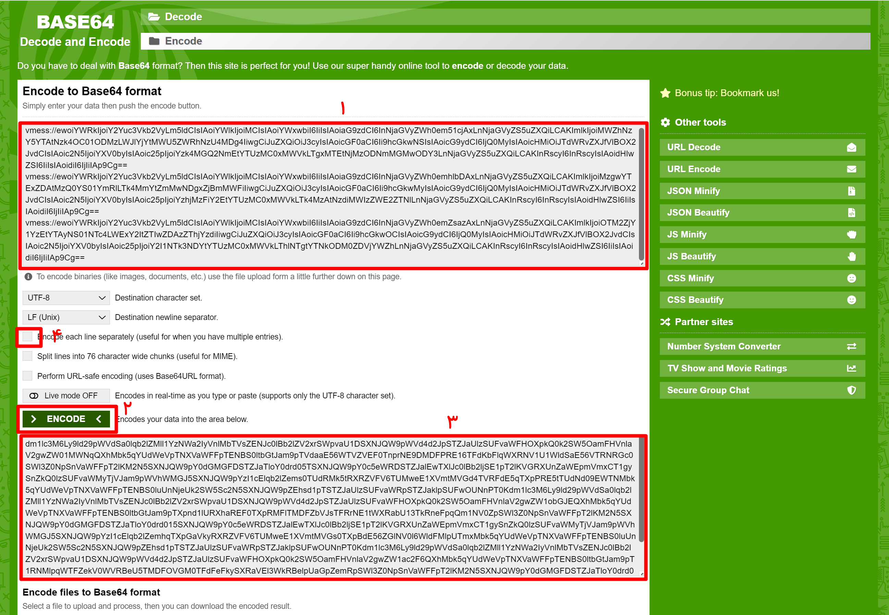
    </img>

**برای ایجاد سابلینک برای هر یوزر مراحل زیر را تکرار کنید.**

وارد سایت [www.base64encode.org](https://www.base64encode.org) شوید.
در کادر شماره 1، لینک هایی که میخواهید به هر یوزر بدهید، جایگزین کنید. دقت کنید که در هر سطر یک لینک باشد. یعنی لینک اول را کپی کرده و بعد از زدن یک اینتر ( یکی از دکمه های کیبورد! ) به سطر بعدر رفته و لینک دیگر را کپی کنید. بعد از کپی کردن تمام لینک هایی که میخواهید به یک یوزر بدهید، در کادر شماره 2، کلیک کنید. بعد از کلیک لینک های انکود شده، در کادر شماره 3 نمایان میشود. کل متن درون کادر شماره 3 را کپی کرده و به مرحله بعدی بروید.

    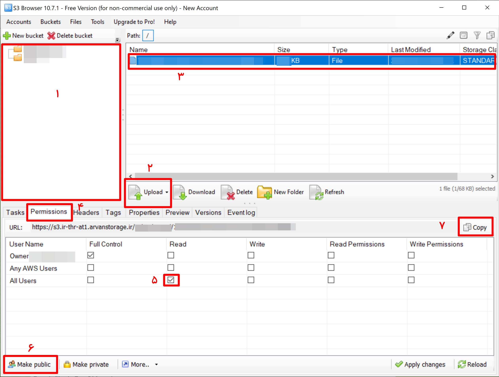
    </img>

- برای مدیریت بهتر سابلینک ها ابتدا در کامپیوتر خود یک فولدر ایجاد کنید.
- داخل فولدر ایجاد شده برای هر یوزر یک فایل تکست ایجاد کنید. بهتر است از نام های تصادفی استفاده کنید تا امکان پیدا کردن لینک ها توسط افراد دیگر از بین برود. پیشنهاد من استفاده از `UUID` خود یوزر در پنل هست. متن انکود شده ای را که در مرحله قبل کپی کردید، داخل فایل کپی کرده و فایل را ذخیره کنید
- در کادر شماره 1، شما تمام صندوقچه هایی را که در سایت آروان ایجاد کرده اید میتوانید مشاهده کنید. روی صندوقچه مورد نظر کلیک کنید.
- در کادر شماره 2، با کلیک بر روی `Upload` از منوی باز شونده، `Upload File` را انتخاب کنید. در پنجره باز شده از داخل فولدری که ایجاد کردید، فایلی را که برای یوزر ساخته اید آپلود کنید.
- بعد از آپلود فایل، فایل آپلود شده در کادر شماره 3، نمایان میشود. با کلیک بر روی آن، فایل را بصورت انتخاب شده، درآورید.
- **نکته خیلی خیلی مهم**  بعد از آپلود فایل و یا بعد از هر بار ویرایش فایل، فایل شما به صورت `private` درمی آید. در این حالت فایل از طریق لینک در دسترس نخواهد بود. برای پابلیک کردن فایل، در حالی که فایل مورد نظر به حالت انتخاب شده هست، بر روی کادر شماره 4، کلیک کنید. در ابتدا که فایل به صورت پرایوت هست تیک کادر شماره 5، خالی هست. برای عمومی کردن فایل روی کادر شماره 6 کلیک کنید. بعد از کلیک کردن خواهید دید که تیک کادر شماره 5 فعال شده است.
- اگر دامنه اختصاصی ثبت نکرده اید، با کلیک بر روی کادر شماره 7، در حالی که فایل مورد نظر به حالت انتخاب شده هست، میتوانید لینک سابسکرایب خود را کپی کرده و به یوزر خود بدهید.
- اگر لینک اختصاصی ثبت کرده اید، لینک فایل خود را از مرحله بعدی دریافت کنید. برای این کار در حالی که فایل مورد نظر در حالت انتخاب هست، کلید های ترکیبی `ctrl + w` را بزنید تا پنجره ساخت لینک اختصاصی باز شود.

    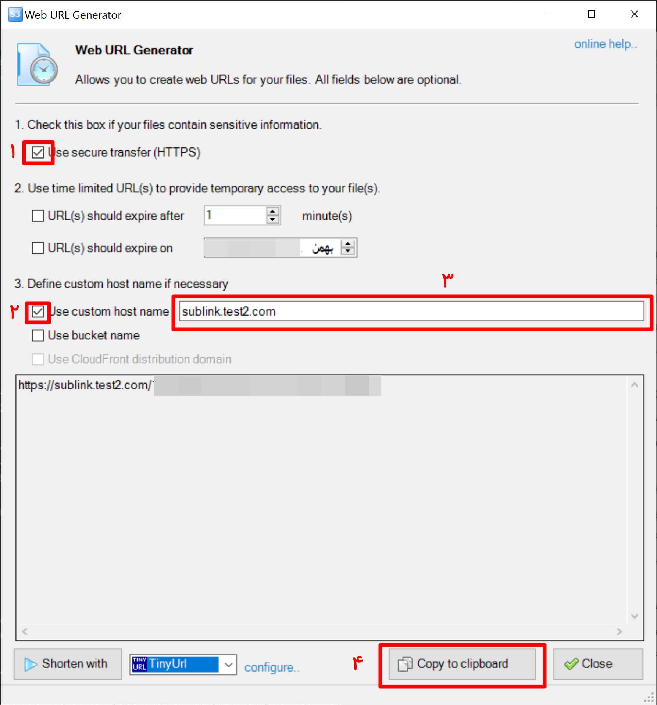
    </img>

- تیک کادرهای شماره 1 و 2 را فعال کنید.
- در کادر شماره 3، سابدامین اختصاصی خود را که در مراحل قبل ایجاد کردید، وارد کنید. د
- با کلیک بر روی کادر شماره 4، لینک خود را کپی کرده و به یوزر خود بدهید.

