# پنل x-ui

برای راحتی کار و مدیریت کانفیگ های مختلف از پنل x-ui استفاده میکنیم. این پنل توسط افراد مختلفی توسعه داده شده که بهترین نسخه آن [FranzKafkaYu](https://github.com/FranzKafkaYu/x-ui) هست. ما در این آموزش این نسخه از پنل را نصب میکنیم.

---

## نصب پنل

ابتدا با دستور زیر وارد پوشه پنل شوید

```bash
cd /opt/freedom/x-ui
```

پورت پیشفرض پنل `54321` است با دستور زیر پورت را در فایروال باز کنید.

```bash
ufw allow 54321
```

با دستور زیر پنل را راه اندازی میکنیم.

```bash
docker-compose up -d
```

آدرس زیر را در مرورگر خود باز کنید تا وارد پنل شوید. به جای `1.2.3.4` آیپی سرور خود را وارد کنید.

```url
http://1.2.3.4:54321
```

یوزرنیم و پسورد پیشفرض پنل `admin` است بعد از وارد کردن بر روی `login` کلیک کنید

<p align="center">
    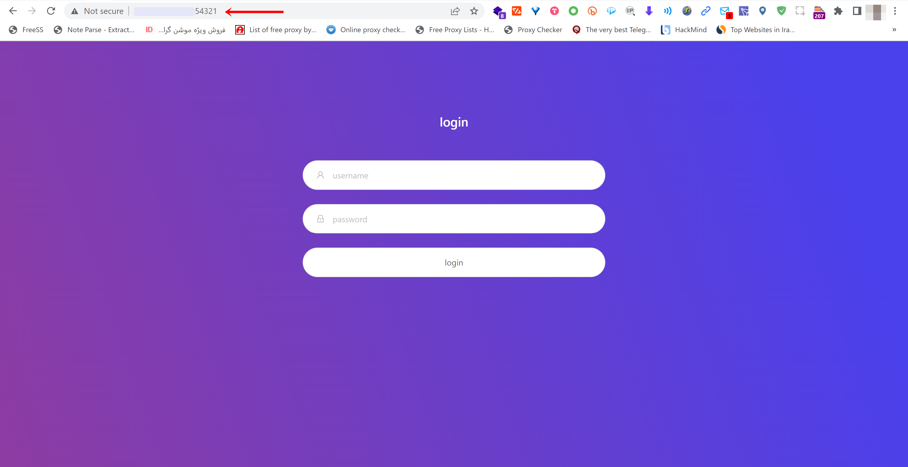
    </img>
</p>

وقتی صفحه اصلی پنل را برای اولین بار باز میکنید، در شماره 1 در تصویر به آدرس پنل دقت کنید. آدرس به صورت `http://1.2.3.4:54321/xui/` دیده میشود. در مرحله بعد این آدرس تغییر خواهد کرد. بر روی `settings` در شماره 2 کلیک کنید.

<p align="center">
    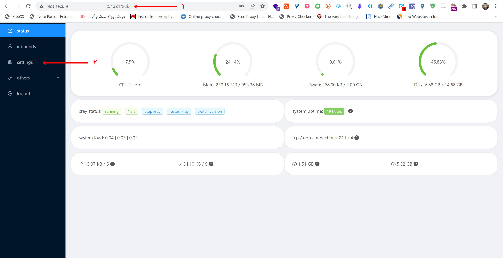
    </img>
</p>

بعد از کلیک بر روی `settings` پس از چند ثانیه دوباره به صفحه اصلی برمیگردید با این تفاوت که آدرس پنل تغییر کرده است. در شماره 1 به آدرس دقت کنید. `http://188.119.113.232:54321/ay4l/xui/` همانطور که مشاهده میکنید بعد از پورت یک مسیر 4 حرفی اضافه شده است. این مسیر در اولین بار که وارد `settings` میشوید به طور تصادفی ایجاد میشود. در مثال ما این مسیر `ay4l` میباشد. علت این تغییر افزایش امنیت پنل هست. از آنجایی که پورت پیشفرض پنل `54321` هست، اگر کسی آیپی سرور شما را بداند میتواند وارد صفحه لاگین پنل شود و درصورتی که رمز پنل را تغییر نداده باشید میتواند وارد صفحه اصلی پنل نیز بشود. این آدرس را ذخیره کنید در غیر اینصورت در دفعات بعدی اگر تنها آیپی و پورت سرور را در مرورگر وارد کنید پنل باز نشده و ارور 404 دریافت میکنید. دوباره بر روی `settings` کلیک کنید.

<p align="center">
    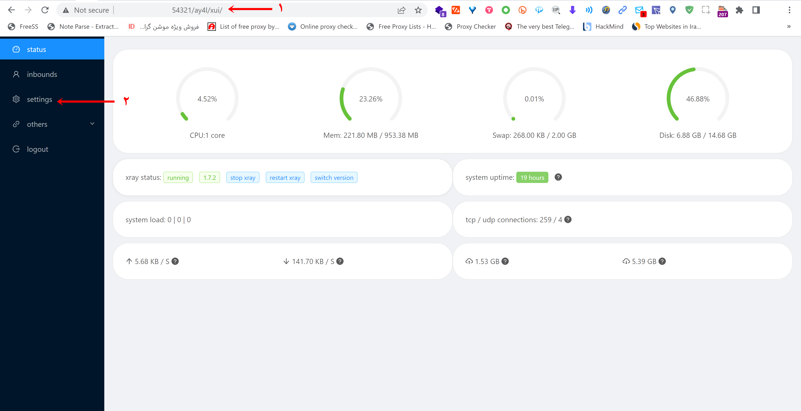
    </img>
</p>

در صفحه باز شده تنظیمات مربوط به پنل را مشاهده میکنید.

- در شماره 1 میتوانید پورت پیشفرض را تغییر دهید. اگر پورت را تغییر دادید باید در ترمینال سرور پورت قبلی را بسته و پورت جدید را جایگزین کنید. (اگر پورت را تغییر ندادید نیازی به انجام دستورات زیر ندارید.) مثلا اگر پورت سرور را به `6587` تغییر دادید، باید دستورات زیر را در ترمینال اجرا کنید

```bash
ufw delete allow 54321
```

```bash
ufw allow 6587
```

- در شماره 2 و 3 در صورتی که میخواهید با دامنه خود و SSL وارد پنل شوید، باید گواهی SSL خود را وارد کنید.
  - اگر طبق آموزش عمل کرده باشید، در شماره 2 مسیر `/opt/cert/fullchain.crt/` را وارد کنید
  - اگر طبق آموزش عمل کرده باشید، در شماره 2 مسیر `/opt/cert/private.key/` را وارد کنید
  - بعد از ذخیره تغییرات آدرس پنل به صورت `https://sub.test.com:54321/ay4l/xui/` خواهد شد. `sub.test.com` را با دامنه خود جایگزین کنید
- درشماره 4 مسیر تصادفی را که در مرحله قبل گفتیم میبینید. در صورتی تمایل میتوانید آن را تغییر دهید. دقت کنید در صورت تغییر بعد از ذخیره کردن تغییرات، پنل باز نخواهد شد و ارور 404 دریافت خواهید کرد. باید مسیر جدید را در آدرس قبلی `http://188.119.113.232:54321/ay4l/xui/` با `ay4l` جایگزین کرده و آدرس را ذخیره کنید.
- در شماره 5، ابتدا بر روی `save` و سپس بر روی `restart` کلیک کنید
- در نهایت در شماره 6 بر روی `User Setting` کلیک کنید.

<p align="center">
    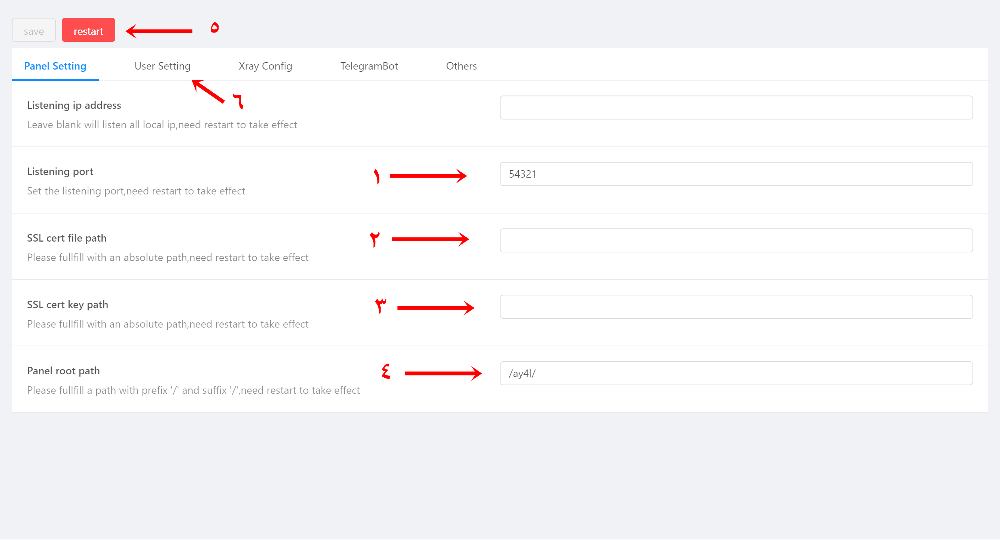
    </img>
</p>

در پنجره باز شده در شماره 1 یوزرنیم و پسورد فعلی خود را که هر دو `admin` هست، وارد کنید. در شماره 2 یوزرنیم و پسورد جدید را وارد کنید. در شماره 3 روی `Modify` کلیک کنید. در نهایت در شماره 4 ابتدا بر روی `save` و سپس `restart` کلیک کنید.

<p align="center">
    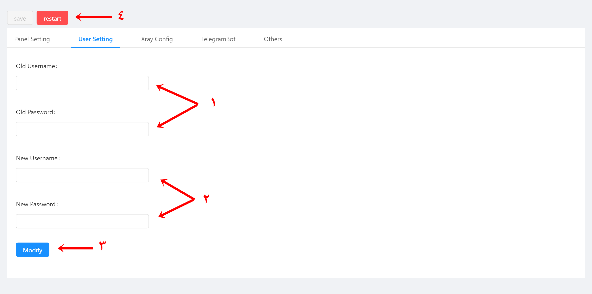
    </img>
</p>

پنل شما آماده استفاده هست !!!

## ساخت Trojan + websocket + TLS

در صفحه اصلی پنل در ستون کناری سمت چپ ابتدا روی `inbounds` و در صفحه باز شده روی `Add inbound` کلیک کنید. تنظیمات را مطابق عکس زیر وارد کنید.

<p align="center">
    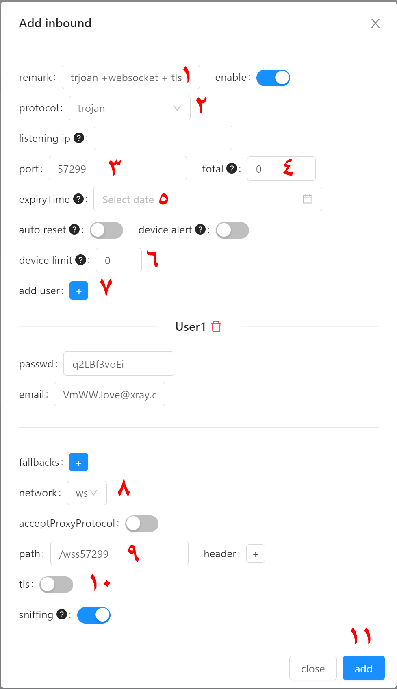
    </img>
</p>

- در شماره 1 یک اسم دلخواه بنویسید
- در شماره 2 از لیست بازشونده `trojan` را انتخاب کنید
- در شماره 3 به صورت تصادفی پنل یک پورت انتخاب میکند این را تغییر ندهید
- در شماره 4 میتوانید محدودیت حجمی برای کاربر ایجاد کنید
- در شماره 5 میتوانید محدودیت زمانی ایجاد کنید
- در شماره 6 میتوانید محدودیت تعداد آیپی را مشخص کنید. در هیچکدام از پنل ها این مورد به درستی کار نمیکند!!!
- در شماره 7 با زدن `+` یک یوزر ایجاد کنید. امکان اضافه کردن چند یوزر وجود دارد اما ما برای هر یوزر یک `inbound` اضافه میکنیم
- در شماره 8 از لیست بازشونده `ws` را انتخاب کنید
- در شماره 9 باید ترکیب کلمه `wss` و پورتی را که در شماره 3 انتخاب شده بنویسید. `wss + port` که در این مثال میشود `/wss57299`.
- در شماره 10 `tls` را خاموش کنید. سرور `nginx` ارتباط tls را هندل خواهد کرد.
- در شماره 11 با زدن بر روی `add` یوزر شما ایجاد خواهد شد.
- باید در لینک یوزر تغییراتی را اعمال کنیم. پس ادامه مطالب را بخوانید

<p align="center">
    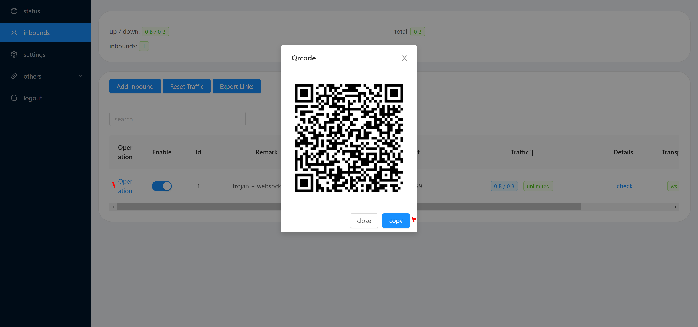
    </img>
</p>

در عکس فوق ابتدا بر روی شماره 1 کلیک کنید و از لیست بازشونده `QR` را انتخاب کنید. در شماره 2 اگر با کلیک بر روی `copy` لینک را کپی کنید و در کلاینت خود وارد کنید. من از `V2rayN` استفاده میکنم.

<p align="center">
    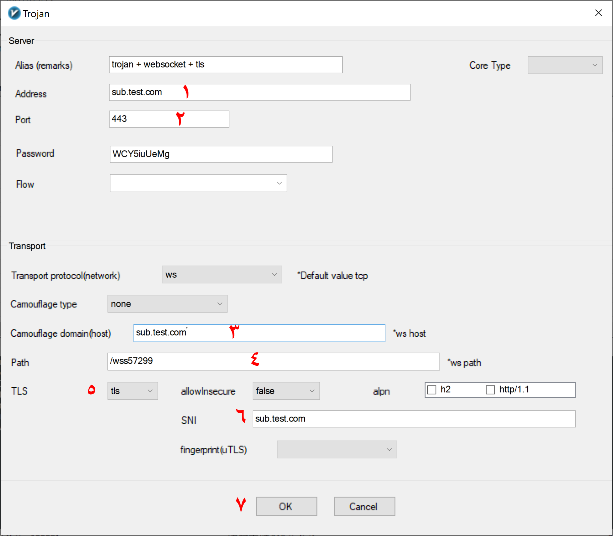
    </img>
</p>

- در شماره 1 چند انتخاب دارید. توصیه میکنیم از تمام این گزینه ها استفاده کنید تا در اپراتورهای مختلف بتوانید با یکی از این موارد وصل شوید. در اینجا ما از دامنه هایی که در آموزش کلاودفلر گفتیم استفاده میکنیم.
  - دامنه مستقیم `sub.test.com`
  - دامنه CDN کلاودفلر `subcdn.test.com`
  - کاستوم آیپی کلاودفلر برای هر اپراتور (به آموزش کلاودفلر مراجعه کنید)
  - دامنه CDN آروان `subcdn.test1.com` در اینصورت شماره های 3 و 6 را به `sub.test1.com` تغییر دهید.
- در شماره 2 اگر طبق آموزش پیش رفته باشید میتوانید `443` و یا `2083` راوارد کنید.
- در شماره 3 و 6 دامنه مستقیم خود را وارد کنید `sub.test.com`
- در شماره 4 عبارت را تغییر ندهید اما میتوانید با اضافه کردن `?ed=2048` سرعت اتصال را بهبود ببخشید. درنهایت به این شکل خواهد بود `/wss57299?ed=2048`
- در شماره 5 از لیست باز شونده `tls` را انتخاب کنید
- در شماره 7 با زدن بر روی `ok` تغییرات را ذخیره کنید.

لینک شما اماده است.

## ساخت Trojan + grpc + TLS

در صفحه اصلی پنل در ستون کناری سمت چپ ابتدا روی `inbounds` و در صفحه باز شده روی `Add inbound` کلیک کنید. تنظیمات را مطابق عکس زیر وارد کنید.

<p align="center">
    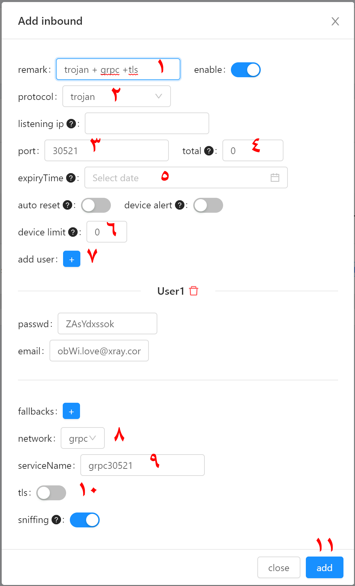
    </img>
</p>

- در شماره 1 یک اسم دلخواه بنویسید
- در شماره 2 از لیست بازشونده `trojan` را انتخاب کنید
- در شماره 3 به صورت تصادفی پنل یک پورت انتخاب میکند این را تغییر ندهید
- در شماره 4 میتوانید محدودیت حجمی برای کاربر ایجاد کنید
- در شماره 5 میتوانید محدودیت زمانی ایجاد کنید
- در شماره 6 میتوانید محدودیت تعداد آیپی را مشخص کنید. در هیچکدام از پنل ها این مورد به درستی کار نمیکند!!!
- در شماره 7 با زدن `+` یک یوزر ایجاد کنید. امکان اضافه کردن چند یوزر وجود دارد اما ما برای هر یوزر یک `inbound` اضافه میکنیم
- در شماره 8 از لیست بازشونده `grpc` را انتخاب کنید
- در شماره 9 باید ترکیب کلمه `grpc` و پورتی را که در شماره 3 انتخاب شده بنویسید. `grpc + port` که در این مثال میشود `grpc30521`.
- در شماره 10 `tls` را خاموش کنید. سرور `nginx` ارتباط tls را هندل خواهد کرد.
- در شماره 11 با زدن بر روی `add` یوزر شما ایجاد خواهد شد.
- باید در لینک یوزر تغییراتی را اعمال کنیم. پس ادامه مطالب را بخوانید

<p align="center">
    
    </img>
</p>

در عکس فوق ابتدا بر روی شماره 1 کلیک کنید و از لیست بازشونده `QR` را انتخاب کنید. در شماره 2 اگر با کلیک بر روی `copy` لینک را کپی کنید و در کلاینت خود وارد کنید. من از `V2rayN` استفاده میکنم.

<p align="center">
    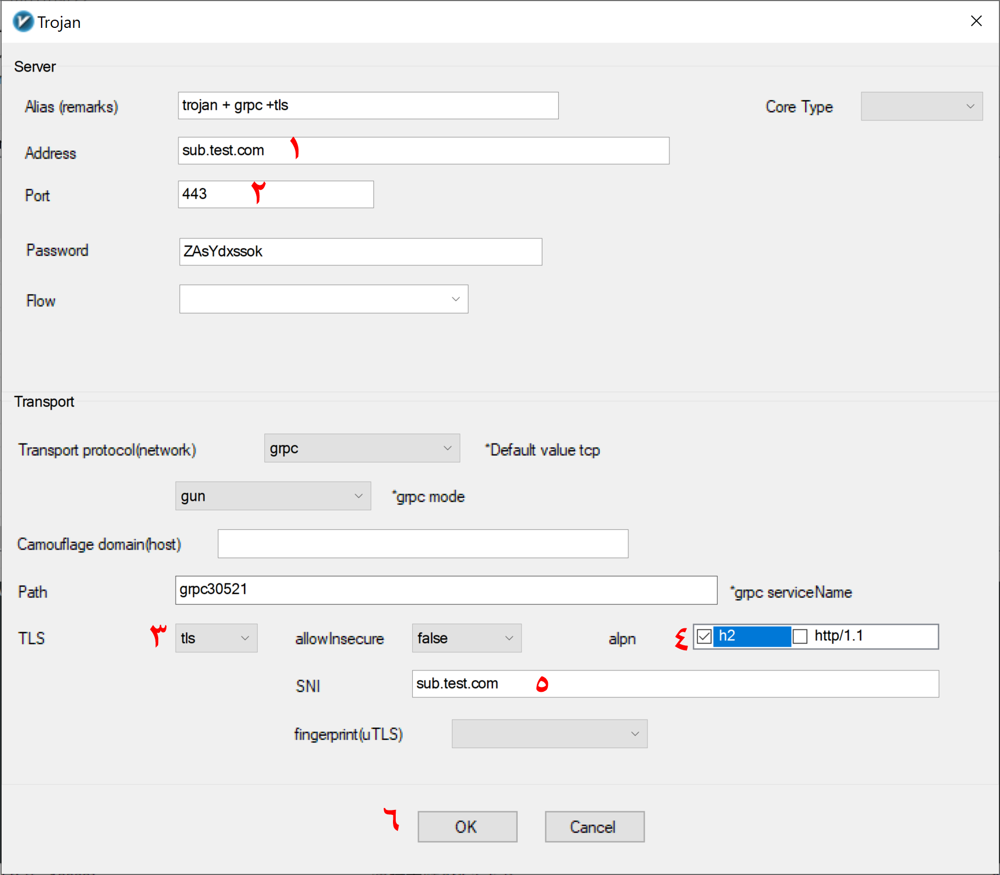
    </img>
</p>

- در شماره 1 چند انتخاب دارید. توصیه میکنیم از تمام این گزینه ها استفاده کنید تا در اپراتورهای مختلف بتوانید با یکی از این موارد وصل شوید. در اینجا ما از دامنه هایی که در آموزش کلاودفلر گفتیم استفاده میکنیم.
  - دامنه مستقیم `sub.test.com`
  - دامنه CDN کلاودفلر `subcdn.test.com`
  - کاستوم آیپی کلاودفلر برای هر اپراتور (به آموزش کلاودفلر مراجعه کنید)
  - دامنه CDN آروان `subcdn.test1.com` در اینصورت شماره 5 را به `sub.test1.com` تغییر دهید.
- در شماره 2 اگر طبق آموزش پیش رفته باشید میتوانید `443` و یا `2083` راوارد کنید.
- در شماره 3 از لیست باز شونده `tls` را انتخاب کنید
- در شماره 4 تیک گزینه `h2` را فعال کنید.
- در شماره 5 دامنه مستقیم خود را وارد کنید `sub.test.com`
- در شماره 6 با زدن بر روی `ok` تغییرات را ذخیره کنید.

لینک شما اماده است.

## ساخت vmess + websocket + (tls)

در صفحه اصلی پنل در ستون کناری سمت چپ ابتدا روی `inbounds` و در صفحه باز شده روی `Add inbound` کلیک کنید. تنظیمات را مطابق عکس زیر وارد کنید.

<p align="center">
    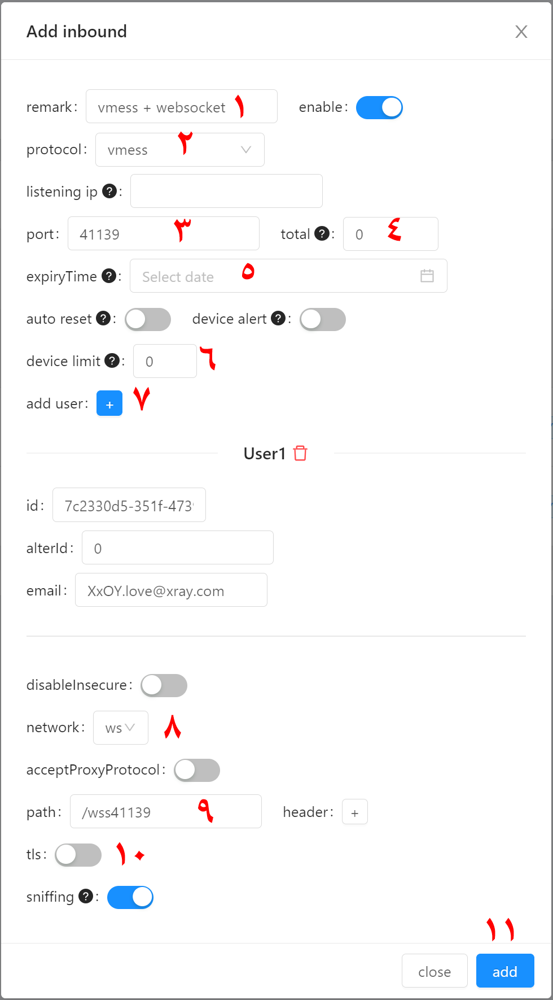
    </img>
</p>

- در شماره 1 یک اسم دلخواه بنویسید
- در شماره 2 از لیست بازشونده `vmess` را انتخاب کنید
- در شماره 3 به صورت تصادفی پنل یک پورت انتخاب میکند این را تغییر ندهید
- در شماره 4 میتوانید محدودیت حجمی برای کاربر ایجاد کنید
- در شماره 5 میتوانید محدودیت زمانی ایجاد کنید
- در شماره 6 میتوانید محدودیت تعداد آیپی را مشخص کنید. در هیچکدام از پنل ها این مورد به درستی کار نمیکند!!!
- در شماره 7 با زدن `+` یک یوزر ایجاد کنید. امکان اضافه کردن چند یوزر وجود دارد اما ما برای هر یوزر یک `inbound` اضافه میکنیم
- در شماره 8 از لیست بازشونده `ws` را انتخاب کنید
- در شماره 9 باید ترکیب کلمه `wss` و پورتی را که در شماره 3 انتخاب شده بنویسید. `wss + port` که در این مثال میشود `/wss41139`.
- در شماره 10 `tls` را خاموش کنید. سرور `nginx` ارتباط tls را هندل خواهد کرد.
- در شماره 11 با زدن بر روی `add` یوزر شما ایجاد خواهد شد.
- باید در لینک یوزر تغییراتی را اعمال کنیم. پس ادامه مطالب را بخوانید

<p align="center">
    
    </img>
</p>

در عکس فوق ابتدا بر روی شماره 1 کلیک کنید و از لیست بازشونده `QR` را انتخاب کنید. در شماره 2 اگر با کلیک بر روی `copy` لینک را کپی کنید و در کلاینت خود وارد کنید. من از `V2rayN` استفاده میکنم.

### با TLS

<p align="center">
    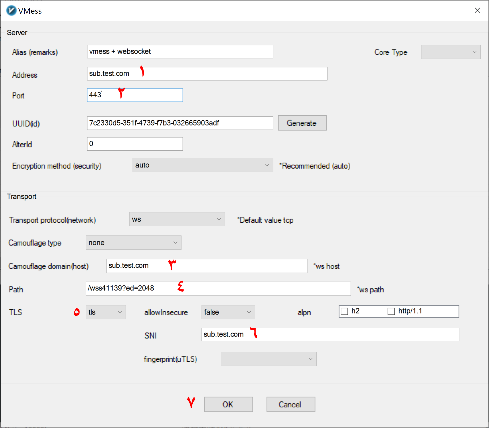
    </img>
</p>

- در شماره 1 چند انتخاب دارید. توصیه میکنیم از تمام این گزینه ها استفاده کنید تا در اپراتورهای مختلف بتوانید با یکی از این موارد وصل شوید. در اینجا ما از دامنه هایی که در آموزش کلاودفلر گفتیم استفاده میکنیم.
  - دامنه مستقیم `sub.test.com`
  - دامنه CDN کلاودفلر `subcdn.test.com`
  - کاستوم آیپی کلاودفلر برای هر اپراتور (به آموزش کلاودفلر مراجعه کنید)
  - دامنه CDN آروان `subcdn.test1.com` در اینصورت شماره های 3 و 6 را به `sub.test1.com` تغییر دهید.
- در شماره 2 اگر طبق آموزش پیش رفته باشید میتوانید `443` و یا `2083` راوارد کنید.
- در شماره 3 و 6 دامنه مستقیم خود را وارد کنید `sub.test.com`
- در شماره 4 عبارت را تغییر ندهید اما میتوانید با اضافه کردن `?ed=2048` سرعت اتصال را بهبود ببخشید. درنهایت به این شکل خواهد بود `/wss41139?ed=2048`
- در شماره 5 از لیست باز شونده `tls` را انتخاب کنید
- در شماره 7 با زدن بر روی `ok` تغییرات را ذخیره کنید.

لینک شما اماده است.

### بدون TLS

همان لینک مرحله قبل را به صورت زیر ویرایش کنید.

<p align="center">
    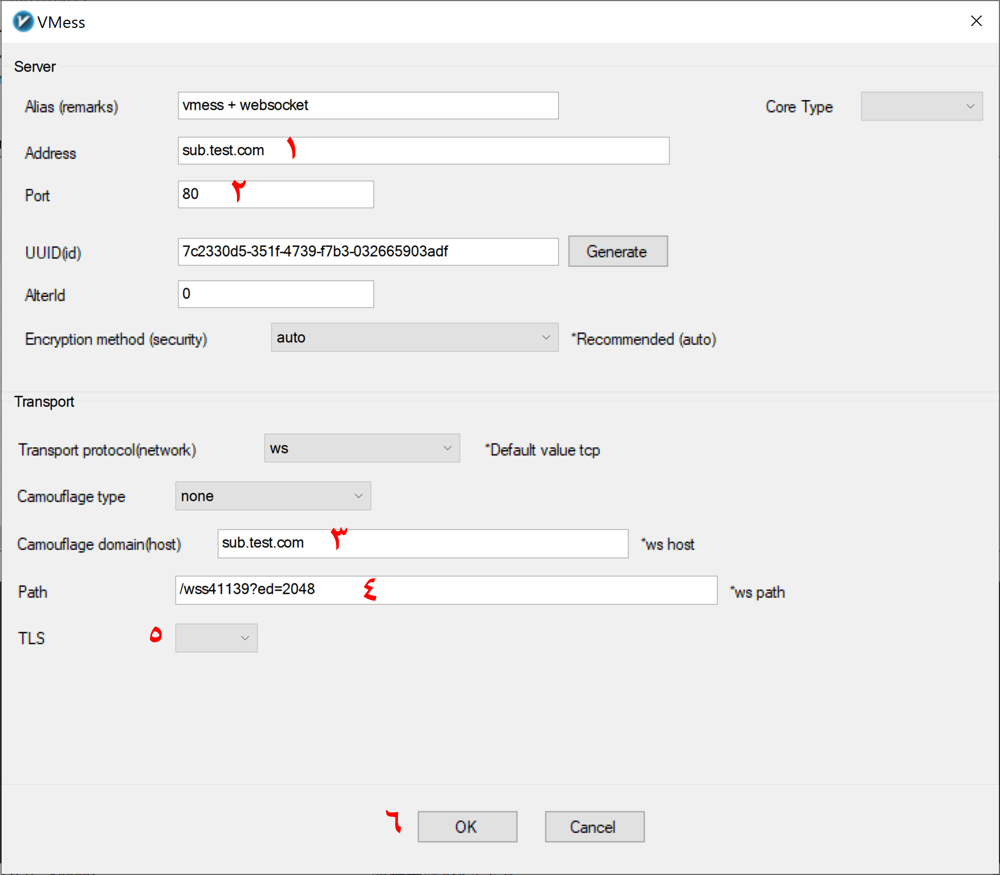
    </img>
</p>

- در شماره 1 چند انتخاب دارید. توصیه میکنیم از تمام این گزینه ها استفاده کنید تا در اپراتورهای مختلف بتوانید با یکی از این موارد وصل شوید. در اینجا ما از دامنه هایی که در آموزش کلاودفلر گفتیم استفاده میکنیم.
  - دامنه مستقیم `sub.test.com`
  - دامنه CDN کلاودفلر `subcdn.test.com`
  - کاستوم آیپی کلاودفلر برای هر اپراتور (به آموزش کلاودفلر مراجعه کنید)
  - دامنه CDN آروان `subcdn.test1.com` در اینصورت شماره های 3 و 6 را به `sub.test1.com` تغییر دهید.
- در شماره 2 `80` راوارد کنید.
- در شماره 3 دامنه مستقیم خود را وارد کنید `sub.test.com`
- در شماره 4 عبارت را تغییر ندهید اما میتوانید با اضافه کردن `?ed=2048` سرعت اتصال را بهبود ببخشید. درنهایت به این شکل خواهد بود `/wss41139?ed=2048`
- در شماره 5 از لیست باز شونده `tls` را انتخاب نکنید و آن را خالی بگذارید!!!
- در شماره 6 با زدن بر روی `ok` تغییرات را ذخیره کنید.

لینک شما اماده است.

## نکات مهم

- میتوانید به جای `trojan` از `vless` نیز استفاده کنید.
- ترکیبات فوق ترکیباتی هستند که در حال حاضر خوب جواب میدهند ترکیبات دیگر توصیه نمیشود هرچند میتوانید خودتان تست کنید.
- اگر از پورت های `80` و `443` و `2083` که به `nginx` اختصاص دادیم استفاده نکنید میتوانید از پورت های دیگر استفاده کنید. در اینصورت ترافیک از `nginx` عبور نمیکند و باید در هنگام ساخت `inbond` ها در قسمت `tls` مسیر گواهی ها را وارد کنید و همچنین پورتی را که قصد استفاده دارید در فایروال باز کنید.ّ
